# Diabetes Classification Using Machine Learning Techniques

## Table of Contents

1. [Introduction](#introduction)
   - [Overview of diabetes and its impact](#overview-of-diabetes)
   - [Objective of the project](#objective-of-the-project)
2. [Dataset Description](#dataset-description)
   - [Source and characteristics of the dataset](#source-and-characteristics-of-dataset)
   - [Features and target variable](#features-and-target-variable)
3. [Data Analysis](#data-analysis)
   - [Loading the Dataset](#loading-the-dataset)
   - [Descriptive statistics](#descriptive-statistics)
   - [Data visualizations](#data-visualization)
3. [Data Exploration and Preprocessing](#data-exploration-and-preprocessing)
   - [Handling Missing Values](#handling-missing-values)
   - [Encoding categorical variables](#encoding-categorical-variables)
   - [Feature scaling](#feature-scaling)
   - [Feature Selection and Engineering](#feature-selection-and-engineering)
   - [Data Normalization](#data-normalization)
4. [Model Development](#model-development)
   - [Logistic Regression](#logistic-regression)
   - [Decision Trees](#decision-trees)
   - [Random Forest](#random-forest)
   - [Support Vector Machines (SVM)](#support-vector-machines-svm)
5. [Model Evaluation and Selection](#model-evaluation-and-selection)
   - [Accuracy](#accuracy)
   - [Precision, Recall, and F1-Score](#precision-recall-and-f1-score)
   - [Cross-Validation](#cross-validation)
6. [Feature Importance Analysis](#feature-importance-analysis)
7. [Deployment and Application](#deployment-and-application)
   - [Developing the Application](#developing-the-application)
   - [User Interface Design](#user-interface-design)
   - [Predictive Functionality](#predictive-functionality)
8. [Documentation and Reporting](#documentation-and-reporting)
   - [Process Documentation](#process-documentation)
   - [Final Report](#final-report)
   - [Visualizations](#visualizations)
9. [Conclusion](#conclusion)
10. [References](#references)
---


### Introduction

Diabetes mellitus, commonly referred to as diabetes, is a chronic medical condition characterized by high levels of blood glucose (blood sugar). It is a major global health concern, affecting over 400 million people worldwide. The disease is primarily categorized into two types: Type 1 diabetes, where the body fails to produce insulin, and Type 2 diabetes, where the body does not use insulin properly. Left unmanaged, diabetes can lead to severe health complications including heart disease, stroke, kidney failure, blindness, and lower limb amputations.

Given the significant impact of diabetes on individuals and healthcare systems, effective prediction and management strategies are critical. Machine learning, with its capability to analyze large datasets and identify patterns, offers promising solutions for early diagnosis, risk assessment, and personalized management of diabetes.


#### Objective

This study aims to explore and optimize two prominent machine learning algorithms, namely XGBoost and Random Forest, for classifying diabetes into different types. Additionally, a binary classification model was developed to predict whether an individual has diabetes or not.


#### Project Overview

This project aims to leverage machine learning techniques to predict the likelihood of diabetes in individuals based on their medical records. The primary objectives of the project are:

1. **Data Exploration and Preprocessing**: Analyzing the dataset to understand its structure and clean any anomalies. This step involves handling missing values, normalizing data, and performing feature selection.

2. **Model Development**: Building and training various machine learning models, including Logistic Regression, Decision Trees, Random Forest, and Support Vector Machines (SVM), to predict diabetes. The models will be evaluated based on their accuracy, precision, recall, and F1-score.

3. **Model Evaluation and Selection**: Comparing the performance of different models to select the best-performing one. Cross-validation techniques will be employed to ensure the robustness of the results.

4. **Feature Importance Analysis**: Identifying the most significant features contributing to diabetes prediction, which can provide insights into the key factors influencing the disease.

5. **Deployment and Application**: Developing a user-friendly application that allows healthcare providers and individuals to input medical data and receive predictions about the likelihood of diabetes. This tool aims to facilitate early diagnosis and personalized management plans.

6. **Documentation and Reporting**: Thoroughly documenting the entire process, from data preprocessing to model deployment, to ensure reproducibility and transparency. The final report will include detailed explanations, visualizations, and interpretations of the results.


#### Impact

The outcomes of this project have the potential to significantly improve diabetes management by providing a reliable predictive tool for early diagnosis. Early identification of high-risk individuals can lead to timely interventions, ultimately reducing the burden of diabetes-related complications. Additionally, the insights gained from feature importance analysis can inform public health strategies and individual lifestyle modifications to mitigate the risk of diabetes.

By integrating advanced machine learning techniques with comprehensive medical data, this project aims to contribute to the broader effort of combating diabetes and enhancing the quality of life for affected individuals.

---

#### References

- National Institute of Diabetes and Digestive and Kidney Diseases (NIDDK). "Diabetes Dataset." UCI Machine Learning Repository. [Link](https://archive.ics.uci.edu/ml/datasets/pima+indians+diabetes).
- World Health Organization. "Diabetes." [Link](https://www.who.int/health-topics/diabetes#tab=tab_1).

    This project exemplifies the practical application of machine learning in healthcare, showcasing the potential to make a meaningful impact on global health outcomes.
---

## Data Description

#### Data Source

The dataset used in this project is derived from the National Institute of Diabetes and Digestive and Kidney Diseases (NIDDK). It contains detailed medical records of patients, including information such as age, BMI, insulin levels, and other relevant health metrics. This dataset is a valuable resource for developing predictive models and has been widely used in academic and professional research. The dataset can be accessed from the UCI Machine Learning Repository: [Diabetes Dataset](https://archive.ics.uci.edu/ml/datasets/pima+indians+diabetes).


The **diabetes_012_health_indicators_BRFSS2015.csv** dataset consists of 253,680 survey responses to the CDC's BRFSS2015, capturing various health indicators. The target variable, `Diabetes_012`, has three classes indicating the diabetes status of respondents. The dataset contains 21 feature variables, each representing different health metrics and behaviors. Below is a detailed description of each column in the dataset:

1. **Diabetes_012**: Diabetes status of the respondent.
    - 0 = No diabetes or only during pregnancy
    - 1 = Prediabetes
    - 2 = Diabetes

2. **HighBP**: High blood pressure status.
    - 0 = No high blood pressure
    - 1 = High blood pressure

3. **HighChol**: High cholesterol status.
    - 0 = No high cholesterol
    - 1 = High cholesterol

4. **CholCheck**: Whether the respondent had a cholesterol check in the past 5 years.
    - 0 = No cholesterol check in 5 years
    - 1 = Yes cholesterol check in 5 years

5. **BMI**: Body Mass Index, a numeric value representing body weight relative to height.

6. **Smoker**: Whether the respondent has smoked at least 100 cigarettes in their entire life.
    - 0 = No
    - 1 = Yes

7. **Stroke**: Whether the respondent has ever been told they had a stroke.
    - 0 = No
    - 1 = Yes

8. **HeartDiseaseorAttack**: Whether the respondent has coronary heart disease (CHD) or myocardial infarction (MI).
    - 0 = No
    - 1 = Yes

9. **PhysActivity**: Physical activity in the past 30 days, not including job-related activities.
    - 0 = No
    - 1 = Yes

10. **Fruits**: Whether the respondent consumes fruit one or more times per day.
    - 0 = No
    - 1 = Yes

11. **Veggies**: Whether the respondent consumes vegetables one or more times per day.
    - 0 = No
    - 1 = Yes

12. **HvyAlcoholConsump**: Heavy drinking status (adult men having more than 14 drinks per week and adult women having more than 7 drinks per week).
    - 0 = No
    - 1 = Yes

13. **AnyHealthcare**: Whether the respondent has any kind of health care coverage, including health insurance, prepaid plans such as HMO, etc.
    - 0 = No
    - 1 = Yes

14. **NoDocbcCost**: Whether there was a time in the past 12 months when the respondent needed to see a doctor but could not because of cost.
    - 0 = No
    - 1 = Yes

15. **GenHlth**: General health status of the respondent.
    - Scale 1-5
        - 1 = Excellent
        - 2 = Very good
        - 3 = Good
        - 4 = Fair
        - 5 = Poor

16. **MentHlth**: Number of days during the past 30 days the respondent's mental health was not good.
    - Scale 1-30 days

17. **PhysHlth**: Number of days during the past 30 days the respondent's physical health was not good.
    - Scale 1-30 days

18. **DiffWalk**: Whether the respondent has serious difficulty walking or climbing stairs.
    - 0 = No
    - 1 = Yes

19. **Sex**: Gender of the respondent.
    - 0 = Female
    - 1 = Male

20. **Age**: 13-level age category.
    - Scale 1-13
        - 1 = 18-24
        - 2 = 25-29
        - 3 = 30-34
        - 4 = 35-39
        - 5 = 40-44
        - 6 = 45-49
        - 7 = 50-54
        - 8 = 55-59
        - 9 = 60-64
        - 10 = 65-69
        - 11 = 70-74
        - 12 = 75-79
        - 13 = 80 or older

21. **Education**: Education level of the respondent.
    - Scale 1-6
        - 1 = Never attended school or only kindergarten
        - 2 = Grades 1 through 8 (Elementary)
        - 3 = Grades 9 through 11 (Some high school)
        - 4 = Grade 12 or GED (High school graduate)
        - 5 = College 1 year to 3 years (Some college or technical school)
        - 6 = College 4 years or more (College graduate)

22. **Income**: Income scale of the respondent.
    - Scale 1-8
        - 1 = Less than $10,000
        - 2 = $10,000 to $14,999
        - 3 = $15,000 to $19,999
        - 4 = $20,000 to $24,999
        - 5 = $25,000 to $34,999
        - 6 = $35,000 to $49,999
        - 7 = $50,000 to $74,999
        - 8 = $75,000 or more

### Summary of Columns

| Column Name              | Description                                                                                                  | Data Type | Categories                      |
|--------------------------|--------------------------------------------------------------------------------------------------------------|-----------|---------------------------------|
| Diabetes_012             | Diabetes status of the respondent                                                                            | Categorical | 0, 1, 2                          |
| HighBP                   | High blood pressure status                                                                                   | Categorical | 0, 1                            |
| HighChol                 | High cholesterol status                                                                                      | Categorical | 0, 1                            |
| CholCheck                | Whether the respondent had a cholesterol check in the past 5 years                                           | Categorical | 0, 1                            |
| BMI                      | Body Mass Index, a numeric value representing body weight relative to height                                 | Numeric    | -                               |
| Smoker                   | Whether the respondent has smoked at least 100 cigarettes in their entire life                               | Categorical | 0, 1                            |
| Stroke                   | Whether the respondent has ever been told they had a stroke                                                  | Categorical | 0, 1                            |
| HeartDiseaseorAttack     | Whether the respondent has coronary heart disease (CHD) or myocardial infarction (MI)                        | Categorical | 0, 1                            |
| PhysActivity             | Physical activity in the past 30 days, not including job-related activities                                  | Categorical | 0, 1                            |
| Fruits                   | Whether the respondent consumes fruit one or more times per day                                              | Categorical | 0, 1                            |
| Veggies                  | Whether the respondent consumes vegetables one or more times per day                                         | Categorical | 0, 1                            |
| HvyAlcoholConsump        | Heavy drinking status (adult men having more than 14 drinks per week and adult women having more than 7 drinks per week) | Categorical | 0, 1                            |
| AnyHealthcare            | Whether the respondent has any kind of health care coverage, including health insurance, prepaid plans such as HMO, etc. | Categorical | 0, 1                            |
| NoDocbcCost              | Whether there was a time in the past 12 months when the respondent needed to see a doctor but could not because of cost | Categorical | 0, 1                            |
| GenHlth                  | General health status of the respondent                                                                      | Categorical | 1, 2, 3, 4, 5                   |
| MentHlth                 | Number of days during the past 30 days the respondent's mental health was not good                            | Numeric    | 1-30                            |
| PhysHlth                 | Number of days during the past 30 days the respondent's physical health was not good                          | Numeric    | 1-30                            |
| DiffWalk                 | Whether the respondent has serious difficulty walking or climbing stairs                                     | Categorical | 0, 1                            |
| Sex                      | Gender of the respondent                                                                                     | Categorical | 0, 1                            |
| Age                      | 13-level age category                                                                                        | Categorical | 1-13                            |
| Education                | Education level of the respondent                                                                            | Categorical | 1-6                             |
| Income                   | Income scale of the respondent                                                                               | Categorical | 1-8                             |

This dataset enables a comprehensive analysis of health indicators and their correlation with diabetes status, providing valuable insights for predictive modeling and public health studies.


## Data Analysis


```python
import numpy as np
import pandas as pd
import matplotlib.pyplot as plt
import seaborn as sns
import plotly.express as px
from imblearn.over_sampling import SMOTE
from sklearn.metrics import mean_squared_error, accuracy_score, f1_score, confusion_matrix
from sklearn.model_selection import train_test_split, KFold
from sklearn.impute import SimpleImputer
from sklearn.preprocessing import OneHotEncoder, MinMaxScaler
from sklearn.tree import DecisionTreeClassifier, plot_tree
from sklearn.ensemble import RandomForestClassifier
from sklearn.linear_model import LogisticRegression
from sklearn.model_selection import RandomizedSearchCV
import xgboost as xgb
from sklearn.ensemble import StackingClassifier
```


```python
from google.colab import drive
drive.mount('/content/gdrive')
```

    Mounted at /content/gdrive
    


```python
sns.set_style('darkgrid')
plt.rcParams['font.size'] = 14
plt.rcParams['figure.figsize'] = (10,6)
plt.rcParams['figure.facecolor'] = '#00000000'
pd.set_option('display.max_columns', None)
%matplotlib inline
```

### Data Loading


```python
data = pd.read_csv("/content/gdrive/MyDrive/diabetes_012_health_indicators_BRFSS2015.csv")
```


```python
data
```


  <div id="df-544a6698-b43c-4b93-af2f-0ccde59aeddc" class="colab-df-container">
    <div>
<style scoped>
    .dataframe tbody tr th:only-of-type {
        vertical-align: middle;
    }

    .dataframe tbody tr th {
        vertical-align: top;
    }

    .dataframe thead th {
        text-align: right;
    }
</style>
<table border="1" class="dataframe">
  <thead>
    <tr style="text-align: right;">
      <th></th>
      <th>Diabetes_012</th>
      <th>HighBP</th>
      <th>HighChol</th>
      <th>CholCheck</th>
      <th>BMI</th>
      <th>Smoker</th>
      <th>Stroke</th>
      <th>HeartDiseaseorAttack</th>
      <th>PhysActivity</th>
      <th>Fruits</th>
      <th>Veggies</th>
      <th>HvyAlcoholConsump</th>
      <th>AnyHealthcare</th>
      <th>NoDocbcCost</th>
      <th>GenHlth</th>
      <th>MentHlth</th>
      <th>PhysHlth</th>
      <th>DiffWalk</th>
      <th>Sex</th>
      <th>Age</th>
      <th>Education</th>
      <th>Income</th>
    </tr>
  </thead>
  <tbody>
    <tr>
      <th>0</th>
      <td>0.0</td>
      <td>1.0</td>
      <td>1.0</td>
      <td>1.0</td>
      <td>40.0</td>
      <td>1.0</td>
      <td>0.0</td>
      <td>0.0</td>
      <td>0.0</td>
      <td>0.0</td>
      <td>1.0</td>
      <td>0.0</td>
      <td>1.0</td>
      <td>0.0</td>
      <td>5.0</td>
      <td>18.0</td>
      <td>15.0</td>
      <td>1.0</td>
      <td>0.0</td>
      <td>9.0</td>
      <td>4.0</td>
      <td>3.0</td>
    </tr>
    <tr>
      <th>1</th>
      <td>0.0</td>
      <td>0.0</td>
      <td>0.0</td>
      <td>0.0</td>
      <td>25.0</td>
      <td>1.0</td>
      <td>0.0</td>
      <td>0.0</td>
      <td>1.0</td>
      <td>0.0</td>
      <td>0.0</td>
      <td>0.0</td>
      <td>0.0</td>
      <td>1.0</td>
      <td>3.0</td>
      <td>0.0</td>
      <td>0.0</td>
      <td>0.0</td>
      <td>0.0</td>
      <td>7.0</td>
      <td>6.0</td>
      <td>1.0</td>
    </tr>
    <tr>
      <th>2</th>
      <td>0.0</td>
      <td>1.0</td>
      <td>1.0</td>
      <td>1.0</td>
      <td>28.0</td>
      <td>0.0</td>
      <td>0.0</td>
      <td>0.0</td>
      <td>0.0</td>
      <td>1.0</td>
      <td>0.0</td>
      <td>0.0</td>
      <td>1.0</td>
      <td>1.0</td>
      <td>5.0</td>
      <td>30.0</td>
      <td>30.0</td>
      <td>1.0</td>
      <td>0.0</td>
      <td>9.0</td>
      <td>4.0</td>
      <td>8.0</td>
    </tr>
    <tr>
      <th>3</th>
      <td>0.0</td>
      <td>1.0</td>
      <td>0.0</td>
      <td>1.0</td>
      <td>27.0</td>
      <td>0.0</td>
      <td>0.0</td>
      <td>0.0</td>
      <td>1.0</td>
      <td>1.0</td>
      <td>1.0</td>
      <td>0.0</td>
      <td>1.0</td>
      <td>0.0</td>
      <td>2.0</td>
      <td>0.0</td>
      <td>0.0</td>
      <td>0.0</td>
      <td>0.0</td>
      <td>11.0</td>
      <td>3.0</td>
      <td>6.0</td>
    </tr>
    <tr>
      <th>4</th>
      <td>0.0</td>
      <td>1.0</td>
      <td>1.0</td>
      <td>1.0</td>
      <td>24.0</td>
      <td>0.0</td>
      <td>0.0</td>
      <td>0.0</td>
      <td>1.0</td>
      <td>1.0</td>
      <td>1.0</td>
      <td>0.0</td>
      <td>1.0</td>
      <td>0.0</td>
      <td>2.0</td>
      <td>3.0</td>
      <td>0.0</td>
      <td>0.0</td>
      <td>0.0</td>
      <td>11.0</td>
      <td>5.0</td>
      <td>4.0</td>
    </tr>
    <tr>
      <th>...</th>
      <td>...</td>
      <td>...</td>
      <td>...</td>
      <td>...</td>
      <td>...</td>
      <td>...</td>
      <td>...</td>
      <td>...</td>
      <td>...</td>
      <td>...</td>
      <td>...</td>
      <td>...</td>
      <td>...</td>
      <td>...</td>
      <td>...</td>
      <td>...</td>
      <td>...</td>
      <td>...</td>
      <td>...</td>
      <td>...</td>
      <td>...</td>
      <td>...</td>
    </tr>
    <tr>
      <th>253675</th>
      <td>0.0</td>
      <td>1.0</td>
      <td>1.0</td>
      <td>1.0</td>
      <td>45.0</td>
      <td>0.0</td>
      <td>0.0</td>
      <td>0.0</td>
      <td>0.0</td>
      <td>1.0</td>
      <td>1.0</td>
      <td>0.0</td>
      <td>1.0</td>
      <td>0.0</td>
      <td>3.0</td>
      <td>0.0</td>
      <td>5.0</td>
      <td>0.0</td>
      <td>1.0</td>
      <td>5.0</td>
      <td>6.0</td>
      <td>7.0</td>
    </tr>
    <tr>
      <th>253676</th>
      <td>2.0</td>
      <td>1.0</td>
      <td>1.0</td>
      <td>1.0</td>
      <td>18.0</td>
      <td>0.0</td>
      <td>0.0</td>
      <td>0.0</td>
      <td>0.0</td>
      <td>0.0</td>
      <td>0.0</td>
      <td>0.0</td>
      <td>1.0</td>
      <td>0.0</td>
      <td>4.0</td>
      <td>0.0</td>
      <td>0.0</td>
      <td>1.0</td>
      <td>0.0</td>
      <td>11.0</td>
      <td>2.0</td>
      <td>4.0</td>
    </tr>
    <tr>
      <th>253677</th>
      <td>0.0</td>
      <td>0.0</td>
      <td>0.0</td>
      <td>1.0</td>
      <td>28.0</td>
      <td>0.0</td>
      <td>0.0</td>
      <td>0.0</td>
      <td>1.0</td>
      <td>1.0</td>
      <td>0.0</td>
      <td>0.0</td>
      <td>1.0</td>
      <td>0.0</td>
      <td>1.0</td>
      <td>0.0</td>
      <td>0.0</td>
      <td>0.0</td>
      <td>0.0</td>
      <td>2.0</td>
      <td>5.0</td>
      <td>2.0</td>
    </tr>
    <tr>
      <th>253678</th>
      <td>0.0</td>
      <td>1.0</td>
      <td>0.0</td>
      <td>1.0</td>
      <td>23.0</td>
      <td>0.0</td>
      <td>0.0</td>
      <td>0.0</td>
      <td>0.0</td>
      <td>1.0</td>
      <td>1.0</td>
      <td>0.0</td>
      <td>1.0</td>
      <td>0.0</td>
      <td>3.0</td>
      <td>0.0</td>
      <td>0.0</td>
      <td>0.0</td>
      <td>1.0</td>
      <td>7.0</td>
      <td>5.0</td>
      <td>1.0</td>
    </tr>
    <tr>
      <th>253679</th>
      <td>2.0</td>
      <td>1.0</td>
      <td>1.0</td>
      <td>1.0</td>
      <td>25.0</td>
      <td>0.0</td>
      <td>0.0</td>
      <td>1.0</td>
      <td>1.0</td>
      <td>1.0</td>
      <td>0.0</td>
      <td>0.0</td>
      <td>1.0</td>
      <td>0.0</td>
      <td>2.0</td>
      <td>0.0</td>
      <td>0.0</td>
      <td>0.0</td>
      <td>0.0</td>
      <td>9.0</td>
      <td>6.0</td>
      <td>2.0</td>
    </tr>
  </tbody>
</table>
<p>253680 rows × 22 columns</p>
</div>
    <div class="colab-df-buttons">

  <div class="colab-df-container">
    <button class="colab-df-convert" onclick="convertToInteractive('df-544a6698-b43c-4b93-af2f-0ccde59aeddc')"
            title="Convert this dataframe to an interactive table."
            style="display:none;">

  <svg xmlns="http://www.w3.org/2000/svg" height="24px" viewBox="0 -960 960 960">
    <path d="M120-120v-720h720v720H120Zm60-500h600v-160H180v160Zm220 220h160v-160H400v160Zm0 220h160v-160H400v160ZM180-400h160v-160H180v160Zm440 0h160v-160H620v160ZM180-180h160v-160H180v160Zm440 0h160v-160H620v160Z"/>
  </svg>
    </button>

  <style>
    .colab-df-container {
      display:flex;
      gap: 12px;
    }

    .colab-df-convert {
      background-color: #E8F0FE;
      border: none;
      border-radius: 50%;
      cursor: pointer;
      display: none;
      fill: #1967D2;
      height: 32px;
      padding: 0 0 0 0;
      width: 32px;
    }

    .colab-df-convert:hover {
      background-color: #E2EBFA;
      box-shadow: 0px 1px 2px rgba(60, 64, 67, 0.3), 0px 1px 3px 1px rgba(60, 64, 67, 0.15);
      fill: #174EA6;
    }

    .colab-df-buttons div {
      margin-bottom: 4px;
    }

    [theme=dark] .colab-df-convert {
      background-color: #3B4455;
      fill: #D2E3FC;
    }

    [theme=dark] .colab-df-convert:hover {
      background-color: #434B5C;
      box-shadow: 0px 1px 3px 1px rgba(0, 0, 0, 0.15);
      filter: drop-shadow(0px 1px 2px rgba(0, 0, 0, 0.3));
      fill: #FFFFFF;
    }
  </style>

    <script>
      const buttonEl =
        document.querySelector('#df-544a6698-b43c-4b93-af2f-0ccde59aeddc button.colab-df-convert');
      buttonEl.style.display =
        google.colab.kernel.accessAllowed ? 'block' : 'none';

      async function convertToInteractive(key) {
        const element = document.querySelector('#df-544a6698-b43c-4b93-af2f-0ccde59aeddc');
        const dataTable =
          await google.colab.kernel.invokeFunction('convertToInteractive',
                                                    [key], {});
        if (!dataTable) return;

        const docLinkHtml = 'Like what you see? Visit the ' +
          '<a target="_blank" href=https://colab.research.google.com/notebooks/data_table.ipynb>data table notebook</a>'
          + ' to learn more about interactive tables.';
        element.innerHTML = '';
        dataTable['output_type'] = 'display_data';
        await google.colab.output.renderOutput(dataTable, element);
        const docLink = document.createElement('div');
        docLink.innerHTML = docLinkHtml;
        element.appendChild(docLink);
      }
    </script>
  </div>


<div id="df-2b5a3f4c-6f0b-4909-a2aa-f8921bc12168">
  <button class="colab-df-quickchart" onclick="quickchart('df-2b5a3f4c-6f0b-4909-a2aa-f8921bc12168')"
            title="Suggest charts"
            style="display:none;">

<svg xmlns="http://www.w3.org/2000/svg" height="24px"viewBox="0 0 24 24"
     width="24px">
    <g>
        <path d="M19 3H5c-1.1 0-2 .9-2 2v14c0 1.1.9 2 2 2h14c1.1 0 2-.9 2-2V5c0-1.1-.9-2-2-2zM9 17H7v-7h2v7zm4 0h-2V7h2v10zm4 0h-2v-4h2v4z"/>
    </g>
</svg>
  </button>

<style>
  .colab-df-quickchart {
      --bg-color: #E8F0FE;
      --fill-color: #1967D2;
      --hover-bg-color: #E2EBFA;
      --hover-fill-color: #174EA6;
      --disabled-fill-color: #AAA;
      --disabled-bg-color: #DDD;
  }

  [theme=dark] .colab-df-quickchart {
      --bg-color: #3B4455;
      --fill-color: #D2E3FC;
      --hover-bg-color: #434B5C;
      --hover-fill-color: #FFFFFF;
      --disabled-bg-color: #3B4455;
      --disabled-fill-color: #666;
  }

  .colab-df-quickchart {
    background-color: var(--bg-color);
    border: none;
    border-radius: 50%;
    cursor: pointer;
    display: none;
    fill: var(--fill-color);
    height: 32px;
    padding: 0;
    width: 32px;
  }

  .colab-df-quickchart:hover {
    background-color: var(--hover-bg-color);
    box-shadow: 0 1px 2px rgba(60, 64, 67, 0.3), 0 1px 3px 1px rgba(60, 64, 67, 0.15);
    fill: var(--button-hover-fill-color);
  }

  .colab-df-quickchart-complete:disabled,
  .colab-df-quickchart-complete:disabled:hover {
    background-color: var(--disabled-bg-color);
    fill: var(--disabled-fill-color);
    box-shadow: none;
  }

  .colab-df-spinner {
    border: 2px solid var(--fill-color);
    border-color: transparent;
    border-bottom-color: var(--fill-color);
    animation:
      spin 1s steps(1) infinite;
  }

  @keyframes spin {
    0% {
      border-color: transparent;
      border-bottom-color: var(--fill-color);
      border-left-color: var(--fill-color);
    }
    20% {
      border-color: transparent;
      border-left-color: var(--fill-color);
      border-top-color: var(--fill-color);
    }
    30% {
      border-color: transparent;
      border-left-color: var(--fill-color);
      border-top-color: var(--fill-color);
      border-right-color: var(--fill-color);
    }
    40% {
      border-color: transparent;
      border-right-color: var(--fill-color);
      border-top-color: var(--fill-color);
    }
    60% {
      border-color: transparent;
      border-right-color: var(--fill-color);
    }
    80% {
      border-color: transparent;
      border-right-color: var(--fill-color);
      border-bottom-color: var(--fill-color);
    }
    90% {
      border-color: transparent;
      border-bottom-color: var(--fill-color);
    }
  }
</style>

  <script>
    async function quickchart(key) {
      const quickchartButtonEl =
        document.querySelector('#' + key + ' button');
      quickchartButtonEl.disabled = true;  // To prevent multiple clicks.
      quickchartButtonEl.classList.add('colab-df-spinner');
      try {
        const charts = await google.colab.kernel.invokeFunction(
            'suggestCharts', [key], {});
      } catch (error) {
        console.error('Error during call to suggestCharts:', error);
      }
      quickchartButtonEl.classList.remove('colab-df-spinner');
      quickchartButtonEl.classList.add('colab-df-quickchart-complete');
    }
    (() => {
      let quickchartButtonEl =
        document.querySelector('#df-2b5a3f4c-6f0b-4909-a2aa-f8921bc12168 button');
      quickchartButtonEl.style.display =
        google.colab.kernel.accessAllowed ? 'block' : 'none';
    })();
  </script>
</div>

  <div id="id_4f6ffdc8-3f01-40d1-bfe6-e76e87381dc1">
    <style>
      .colab-df-generate {
        background-color: #E8F0FE;
        border: none;
        border-radius: 50%;
        cursor: pointer;
        display: none;
        fill: #1967D2;
        height: 32px;
        padding: 0 0 0 0;
        width: 32px;
      }

      .colab-df-generate:hover {
        background-color: #E2EBFA;
        box-shadow: 0px 1px 2px rgba(60, 64, 67, 0.3), 0px 1px 3px 1px rgba(60, 64, 67, 0.15);
        fill: #174EA6;
      }

      [theme=dark] .colab-df-generate {
        background-color: #3B4455;
        fill: #D2E3FC;
      }

      [theme=dark] .colab-df-generate:hover {
        background-color: #434B5C;
        box-shadow: 0px 1px 3px 1px rgba(0, 0, 0, 0.15);
        filter: drop-shadow(0px 1px 2px rgba(0, 0, 0, 0.3));
        fill: #FFFFFF;
      }
    </style>
    <button class="colab-df-generate" onclick="generateWithVariable('data')"
            title="Generate code using this dataframe."
            style="display:none;">

  <svg xmlns="http://www.w3.org/2000/svg" height="24px"viewBox="0 0 24 24"
       width="24px">
    <path d="M7,19H8.4L18.45,9,17,7.55,7,17.6ZM5,21V16.75L18.45,3.32a2,2,0,0,1,2.83,0l1.4,1.43a1.91,1.91,0,0,1,.58,1.4,1.91,1.91,0,0,1-.58,1.4L9.25,21ZM18.45,9,17,7.55Zm-12,3A5.31,5.31,0,0,0,4.9,8.1,5.31,5.31,0,0,0,1,6.5,5.31,5.31,0,0,0,4.9,4.9,5.31,5.31,0,0,0,6.5,1,5.31,5.31,0,0,0,8.1,4.9,5.31,5.31,0,0,0,12,6.5,5.46,5.46,0,0,0,6.5,12Z"/>
  </svg>
    </button>
    <script>
      (() => {
      const buttonEl =
        document.querySelector('#id_4f6ffdc8-3f01-40d1-bfe6-e76e87381dc1 button.colab-df-generate');
      buttonEl.style.display =
        google.colab.kernel.accessAllowed ? 'block' : 'none';

      buttonEl.onclick = () => {
        google.colab.notebook.generateWithVariable('data');
      }
      })();
    </script>
  </div>

    </div>
  </div>


```python
data.info()
```

    <class 'pandas.core.frame.DataFrame'>
    RangeIndex: 253680 entries, 0 to 253679
    Data columns (total 22 columns):
     #   Column                Non-Null Count   Dtype  
    ---  ------                --------------   -----  
     0   Diabetes_012          253680 non-null  float64
     1   HighBP                253680 non-null  float64
     2   HighChol              253680 non-null  float64
     3   CholCheck             253680 non-null  float64
     4   BMI                   253680 non-null  float64
     5   Smoker                253680 non-null  float64
     6   Stroke                253680 non-null  float64
     7   HeartDiseaseorAttack  253680 non-null  float64
     8   PhysActivity          253680 non-null  float64
     9   Fruits                253680 non-null  float64
     10  Veggies               253680 non-null  float64
     11  HvyAlcoholConsump     253680 non-null  float64
     12  AnyHealthcare         253680 non-null  float64
     13  NoDocbcCost           253680 non-null  float64
     14  GenHlth               253680 non-null  float64
     15  MentHlth              253680 non-null  float64
     16  PhysHlth              253680 non-null  float64
     17  DiffWalk              253680 non-null  float64
     18  Sex                   253680 non-null  float64
     19  Age                   253680 non-null  float64
     20  Education             253680 non-null  float64
     21  Income                253680 non-null  float64
    dtypes: float64(22)
    memory usage: 42.6 MB
    


```python
data.isna().sum()
```


    Diabetes_012            0
    HighBP                  0
    HighChol                0
    CholCheck               0
    BMI                     0
    Smoker                  0
    Stroke                  0
    HeartDiseaseorAttack    0
    PhysActivity            0
    Fruits                  0
    Veggies                 0
    HvyAlcoholConsump       0
    AnyHealthcare           0
    NoDocbcCost             0
    GenHlth                 0
    MentHlth                0
    PhysHlth                0
    DiffWalk                0
    Sex                     0
    Age                     0
    Education               0
    Income                  0
    dtype: int64


```python
data.describe()
```


  <div id="df-cc463a01-c24e-4a06-8d88-309012217fb2" class="colab-df-container">
    <div>
<style scoped>
    .dataframe tbody tr th:only-of-type {
        vertical-align: middle;
    }

    .dataframe tbody tr th {
        vertical-align: top;
    }

    .dataframe thead th {
        text-align: right;
    }
</style>
<table border="1" class="dataframe">
  <thead>
    <tr style="text-align: right;">
      <th></th>
      <th>Diabetes_012</th>
      <th>HighBP</th>
      <th>HighChol</th>
      <th>CholCheck</th>
      <th>BMI</th>
      <th>Smoker</th>
      <th>Stroke</th>
      <th>HeartDiseaseorAttack</th>
      <th>PhysActivity</th>
      <th>Fruits</th>
      <th>Veggies</th>
      <th>HvyAlcoholConsump</th>
      <th>AnyHealthcare</th>
      <th>NoDocbcCost</th>
      <th>GenHlth</th>
      <th>MentHlth</th>
      <th>PhysHlth</th>
      <th>DiffWalk</th>
      <th>Sex</th>
      <th>Age</th>
      <th>Education</th>
      <th>Income</th>
    </tr>
  </thead>
  <tbody>
    <tr>
      <th>count</th>
      <td>253680.000000</td>
      <td>253680.000000</td>
      <td>253680.000000</td>
      <td>253680.000000</td>
      <td>253680.000000</td>
      <td>253680.000000</td>
      <td>253680.000000</td>
      <td>253680.000000</td>
      <td>253680.000000</td>
      <td>253680.000000</td>
      <td>253680.000000</td>
      <td>253680.000000</td>
      <td>253680.000000</td>
      <td>253680.000000</td>
      <td>253680.000000</td>
      <td>253680.000000</td>
      <td>253680.000000</td>
      <td>253680.000000</td>
      <td>253680.000000</td>
      <td>253680.000000</td>
      <td>253680.000000</td>
      <td>253680.000000</td>
    </tr>
    <tr>
      <th>mean</th>
      <td>0.296921</td>
      <td>0.429001</td>
      <td>0.424121</td>
      <td>0.962670</td>
      <td>28.382364</td>
      <td>0.443169</td>
      <td>0.040571</td>
      <td>0.094186</td>
      <td>0.756544</td>
      <td>0.634256</td>
      <td>0.811420</td>
      <td>0.056197</td>
      <td>0.951053</td>
      <td>0.084177</td>
      <td>2.511392</td>
      <td>3.184772</td>
      <td>4.242081</td>
      <td>0.168224</td>
      <td>0.440342</td>
      <td>8.032119</td>
      <td>5.050434</td>
      <td>6.053875</td>
    </tr>
    <tr>
      <th>std</th>
      <td>0.698160</td>
      <td>0.494934</td>
      <td>0.494210</td>
      <td>0.189571</td>
      <td>6.608694</td>
      <td>0.496761</td>
      <td>0.197294</td>
      <td>0.292087</td>
      <td>0.429169</td>
      <td>0.481639</td>
      <td>0.391175</td>
      <td>0.230302</td>
      <td>0.215759</td>
      <td>0.277654</td>
      <td>1.068477</td>
      <td>7.412847</td>
      <td>8.717951</td>
      <td>0.374066</td>
      <td>0.496429</td>
      <td>3.054220</td>
      <td>0.985774</td>
      <td>2.071148</td>
    </tr>
    <tr>
      <th>min</th>
      <td>0.000000</td>
      <td>0.000000</td>
      <td>0.000000</td>
      <td>0.000000</td>
      <td>12.000000</td>
      <td>0.000000</td>
      <td>0.000000</td>
      <td>0.000000</td>
      <td>0.000000</td>
      <td>0.000000</td>
      <td>0.000000</td>
      <td>0.000000</td>
      <td>0.000000</td>
      <td>0.000000</td>
      <td>1.000000</td>
      <td>0.000000</td>
      <td>0.000000</td>
      <td>0.000000</td>
      <td>0.000000</td>
      <td>1.000000</td>
      <td>1.000000</td>
      <td>1.000000</td>
    </tr>
    <tr>
      <th>25%</th>
      <td>0.000000</td>
      <td>0.000000</td>
      <td>0.000000</td>
      <td>1.000000</td>
      <td>24.000000</td>
      <td>0.000000</td>
      <td>0.000000</td>
      <td>0.000000</td>
      <td>1.000000</td>
      <td>0.000000</td>
      <td>1.000000</td>
      <td>0.000000</td>
      <td>1.000000</td>
      <td>0.000000</td>
      <td>2.000000</td>
      <td>0.000000</td>
      <td>0.000000</td>
      <td>0.000000</td>
      <td>0.000000</td>
      <td>6.000000</td>
      <td>4.000000</td>
      <td>5.000000</td>
    </tr>
    <tr>
      <th>50%</th>
      <td>0.000000</td>
      <td>0.000000</td>
      <td>0.000000</td>
      <td>1.000000</td>
      <td>27.000000</td>
      <td>0.000000</td>
      <td>0.000000</td>
      <td>0.000000</td>
      <td>1.000000</td>
      <td>1.000000</td>
      <td>1.000000</td>
      <td>0.000000</td>
      <td>1.000000</td>
      <td>0.000000</td>
      <td>2.000000</td>
      <td>0.000000</td>
      <td>0.000000</td>
      <td>0.000000</td>
      <td>0.000000</td>
      <td>8.000000</td>
      <td>5.000000</td>
      <td>7.000000</td>
    </tr>
    <tr>
      <th>75%</th>
      <td>0.000000</td>
      <td>1.000000</td>
      <td>1.000000</td>
      <td>1.000000</td>
      <td>31.000000</td>
      <td>1.000000</td>
      <td>0.000000</td>
      <td>0.000000</td>
      <td>1.000000</td>
      <td>1.000000</td>
      <td>1.000000</td>
      <td>0.000000</td>
      <td>1.000000</td>
      <td>0.000000</td>
      <td>3.000000</td>
      <td>2.000000</td>
      <td>3.000000</td>
      <td>0.000000</td>
      <td>1.000000</td>
      <td>10.000000</td>
      <td>6.000000</td>
      <td>8.000000</td>
    </tr>
    <tr>
      <th>max</th>
      <td>2.000000</td>
      <td>1.000000</td>
      <td>1.000000</td>
      <td>1.000000</td>
      <td>98.000000</td>
      <td>1.000000</td>
      <td>1.000000</td>
      <td>1.000000</td>
      <td>1.000000</td>
      <td>1.000000</td>
      <td>1.000000</td>
      <td>1.000000</td>
      <td>1.000000</td>
      <td>1.000000</td>
      <td>5.000000</td>
      <td>30.000000</td>
      <td>30.000000</td>
      <td>1.000000</td>
      <td>1.000000</td>
      <td>13.000000</td>
      <td>6.000000</td>
      <td>8.000000</td>
    </tr>
  </tbody>
</table>
</div>
    <div class="colab-df-buttons">

  <div class="colab-df-container">
    <button class="colab-df-convert" onclick="convertToInteractive('df-cc463a01-c24e-4a06-8d88-309012217fb2')"
            title="Convert this dataframe to an interactive table."
            style="display:none;">

  <svg xmlns="http://www.w3.org/2000/svg" height="24px" viewBox="0 -960 960 960">
    <path d="M120-120v-720h720v720H120Zm60-500h600v-160H180v160Zm220 220h160v-160H400v160Zm0 220h160v-160H400v160ZM180-400h160v-160H180v160Zm440 0h160v-160H620v160ZM180-180h160v-160H180v160Zm440 0h160v-160H620v160Z"/>
  </svg>
    </button>

  <style>
    .colab-df-container {
      display:flex;
      gap: 12px;
    }

    .colab-df-convert {
      background-color: #E8F0FE;
      border: none;
      border-radius: 50%;
      cursor: pointer;
      display: none;
      fill: #1967D2;
      height: 32px;
      padding: 0 0 0 0;
      width: 32px;
    }

    .colab-df-convert:hover {
      background-color: #E2EBFA;
      box-shadow: 0px 1px 2px rgba(60, 64, 67, 0.3), 0px 1px 3px 1px rgba(60, 64, 67, 0.15);
      fill: #174EA6;
    }

    .colab-df-buttons div {
      margin-bottom: 4px;
    }

    [theme=dark] .colab-df-convert {
      background-color: #3B4455;
      fill: #D2E3FC;
    }

    [theme=dark] .colab-df-convert:hover {
      background-color: #434B5C;
      box-shadow: 0px 1px 3px 1px rgba(0, 0, 0, 0.15);
      filter: drop-shadow(0px 1px 2px rgba(0, 0, 0, 0.3));
      fill: #FFFFFF;
    }
  </style>

    <script>
      const buttonEl =
        document.querySelector('#df-cc463a01-c24e-4a06-8d88-309012217fb2 button.colab-df-convert');
      buttonEl.style.display =
        google.colab.kernel.accessAllowed ? 'block' : 'none';

      async function convertToInteractive(key) {
        const element = document.querySelector('#df-cc463a01-c24e-4a06-8d88-309012217fb2');
        const dataTable =
          await google.colab.kernel.invokeFunction('convertToInteractive',
                                                    [key], {});
        if (!dataTable) return;

        const docLinkHtml = 'Like what you see? Visit the ' +
          '<a target="_blank" href=https://colab.research.google.com/notebooks/data_table.ipynb>data table notebook</a>'
          + ' to learn more about interactive tables.';
        element.innerHTML = '';
        dataTable['output_type'] = 'display_data';
        await google.colab.output.renderOutput(dataTable, element);
        const docLink = document.createElement('div');
        docLink.innerHTML = docLinkHtml;
        element.appendChild(docLink);
      }
    </script>
  </div>


<div id="df-6a107054-56f9-448e-ba02-324456e33a18">
  <button class="colab-df-quickchart" onclick="quickchart('df-6a107054-56f9-448e-ba02-324456e33a18')"
            title="Suggest charts"
            style="display:none;">

<svg xmlns="http://www.w3.org/2000/svg" height="24px"viewBox="0 0 24 24"
     width="24px">
    <g>
        <path d="M19 3H5c-1.1 0-2 .9-2 2v14c0 1.1.9 2 2 2h14c1.1 0 2-.9 2-2V5c0-1.1-.9-2-2-2zM9 17H7v-7h2v7zm4 0h-2V7h2v10zm4 0h-2v-4h2v4z"/>
    </g>
</svg>
  </button>

<style>
  .colab-df-quickchart {
      --bg-color: #E8F0FE;
      --fill-color: #1967D2;
      --hover-bg-color: #E2EBFA;
      --hover-fill-color: #174EA6;
      --disabled-fill-color: #AAA;
      --disabled-bg-color: #DDD;
  }

  [theme=dark] .colab-df-quickchart {
      --bg-color: #3B4455;
      --fill-color: #D2E3FC;
      --hover-bg-color: #434B5C;
      --hover-fill-color: #FFFFFF;
      --disabled-bg-color: #3B4455;
      --disabled-fill-color: #666;
  }

  .colab-df-quickchart {
    background-color: var(--bg-color);
    border: none;
    border-radius: 50%;
    cursor: pointer;
    display: none;
    fill: var(--fill-color);
    height: 32px;
    padding: 0;
    width: 32px;
  }

  .colab-df-quickchart:hover {
    background-color: var(--hover-bg-color);
    box-shadow: 0 1px 2px rgba(60, 64, 67, 0.3), 0 1px 3px 1px rgba(60, 64, 67, 0.15);
    fill: var(--button-hover-fill-color);
  }

  .colab-df-quickchart-complete:disabled,
  .colab-df-quickchart-complete:disabled:hover {
    background-color: var(--disabled-bg-color);
    fill: var(--disabled-fill-color);
    box-shadow: none;
  }

  .colab-df-spinner {
    border: 2px solid var(--fill-color);
    border-color: transparent;
    border-bottom-color: var(--fill-color);
    animation:
      spin 1s steps(1) infinite;
  }

  @keyframes spin {
    0% {
      border-color: transparent;
      border-bottom-color: var(--fill-color);
      border-left-color: var(--fill-color);
    }
    20% {
      border-color: transparent;
      border-left-color: var(--fill-color);
      border-top-color: var(--fill-color);
    }
    30% {
      border-color: transparent;
      border-left-color: var(--fill-color);
      border-top-color: var(--fill-color);
      border-right-color: var(--fill-color);
    }
    40% {
      border-color: transparent;
      border-right-color: var(--fill-color);
      border-top-color: var(--fill-color);
    }
    60% {
      border-color: transparent;
      border-right-color: var(--fill-color);
    }
    80% {
      border-color: transparent;
      border-right-color: var(--fill-color);
      border-bottom-color: var(--fill-color);
    }
    90% {
      border-color: transparent;
      border-bottom-color: var(--fill-color);
    }
  }
</style>

  <script>
    async function quickchart(key) {
      const quickchartButtonEl =
        document.querySelector('#' + key + ' button');
      quickchartButtonEl.disabled = true;  // To prevent multiple clicks.
      quickchartButtonEl.classList.add('colab-df-spinner');
      try {
        const charts = await google.colab.kernel.invokeFunction(
            'suggestCharts', [key], {});
      } catch (error) {
        console.error('Error during call to suggestCharts:', error);
      }
      quickchartButtonEl.classList.remove('colab-df-spinner');
      quickchartButtonEl.classList.add('colab-df-quickchart-complete');
    }
    (() => {
      let quickchartButtonEl =
        document.querySelector('#df-6a107054-56f9-448e-ba02-324456e33a18 button');
      quickchartButtonEl.style.display =
        google.colab.kernel.accessAllowed ? 'block' : 'none';
    })();
  </script>
</div>

    </div>
  </div>


## EDA


```python
categorical_cols = [
    'HighBP', 'HighChol', 'CholCheck', 'Smoker', 'Stroke', 'HeartDiseaseorAttack',
    'PhysActivity', 'Fruits', 'Veggies', 'HvyAlcoholConsump', 'AnyHealthcare',
    'NoDocbcCost', 'GenHlth', 'DiffWalk', 'Sex', 'Age', 'Education', 'Income'
]
numeric_cols = ['BMI', 'MentHlth', 'PhysHlth']

# Create a grid of subplots
fig, axes = plt.subplots(8, 3, figsize=(25, 40))
fig.tight_layout(pad=5.0)

# Flatten the axes array for easy iteration
axes = axes.flatten()

# Plot each categorical column
for i, col in enumerate(categorical_cols):
    sns.countplot(data=data, x=col, hue='Diabetes_012', ax=axes[i])
    axes[i].set_title(f'{col} distribution by Diabetes_012')

# Plot each numeric column
for i, col in enumerate(numeric_cols):
    sns.histplot(data=data, x=col, hue='Diabetes_012', kde=True, ax=axes[len(categorical_cols) + i])
    axes[len(categorical_cols) + i].set_title(f'{col} distribution by Diabetes_012')

# Hide any remaining empty subplots
for j in range(len(categorical_cols) + len(numeric_cols), len(axes)):
    fig.delaxes(axes[j])

# Display the plot
plt.show()
```


    
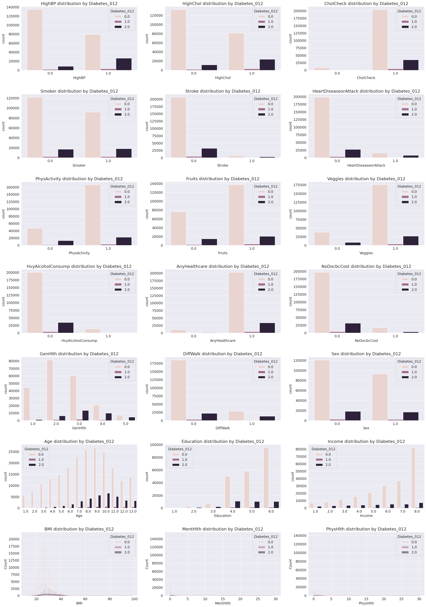
    


```python
sns.histplot(data, x='BMI')
plt.show()
```


    
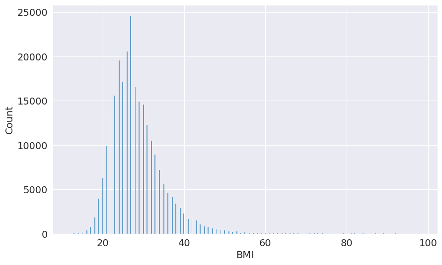
    


```python
sns.histplot(x=np.log(data['BMI']))
plt.show()
```


    
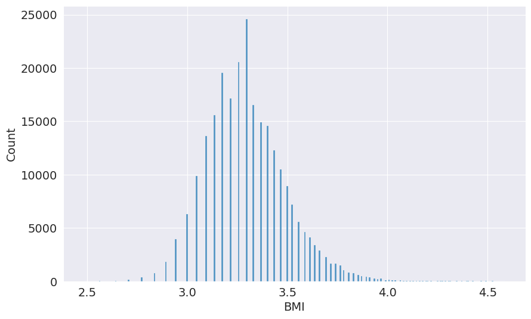
    


```python
sns.countplot(data, x='Diabetes_012')
plt.show()
```


    
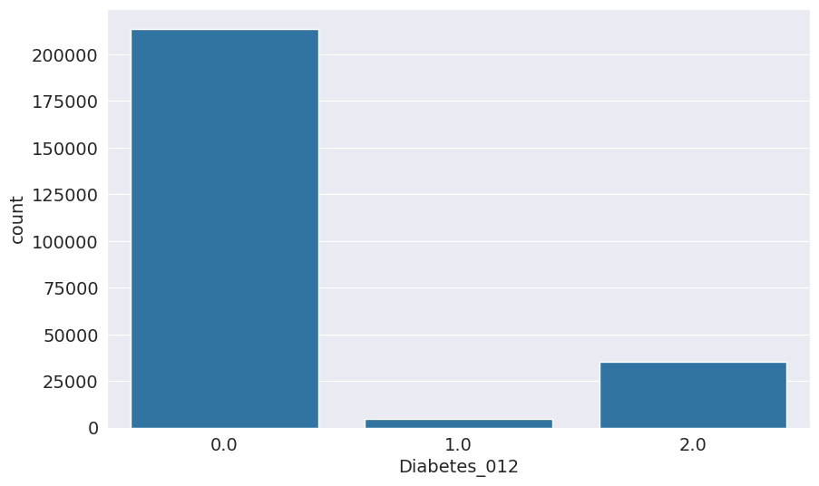
    


### Identifying correlation


```python
data.corr()
```


  <div id="df-26e1f8fc-7b02-4f14-9207-a1ba6ff7836d" class="colab-df-container">
    <div>
<style scoped>
    .dataframe tbody tr th:only-of-type {
        vertical-align: middle;
    }

    .dataframe tbody tr th {
        vertical-align: top;
    }

    .dataframe thead th {
        text-align: right;
    }
</style>
<table border="1" class="dataframe">
  <thead>
    <tr style="text-align: right;">
      <th></th>
      <th>Diabetes_012</th>
      <th>HighBP</th>
      <th>HighChol</th>
      <th>CholCheck</th>
      <th>BMI</th>
      <th>Smoker</th>
      <th>Stroke</th>
      <th>HeartDiseaseorAttack</th>
      <th>PhysActivity</th>
      <th>Fruits</th>
      <th>Veggies</th>
      <th>HvyAlcoholConsump</th>
      <th>AnyHealthcare</th>
      <th>NoDocbcCost</th>
      <th>GenHlth</th>
      <th>MentHlth</th>
      <th>PhysHlth</th>
      <th>DiffWalk</th>
      <th>Sex</th>
      <th>Age</th>
      <th>Education</th>
      <th>Income</th>
    </tr>
  </thead>
  <tbody>
    <tr>
      <th>Diabetes_012</th>
      <td>1.000000</td>
      <td>0.271596</td>
      <td>0.209085</td>
      <td>0.067546</td>
      <td>0.224379</td>
      <td>0.062914</td>
      <td>0.107179</td>
      <td>0.180272</td>
      <td>-0.121947</td>
      <td>-0.042192</td>
      <td>-0.058972</td>
      <td>-0.057882</td>
      <td>0.015410</td>
      <td>0.035436</td>
      <td>0.302587</td>
      <td>0.073507</td>
      <td>0.176287</td>
      <td>0.224239</td>
      <td>0.031040</td>
      <td>0.185026</td>
      <td>-0.130517</td>
      <td>-0.171483</td>
    </tr>
    <tr>
      <th>HighBP</th>
      <td>0.271596</td>
      <td>1.000000</td>
      <td>0.298199</td>
      <td>0.098508</td>
      <td>0.213748</td>
      <td>0.096991</td>
      <td>0.129575</td>
      <td>0.209361</td>
      <td>-0.125267</td>
      <td>-0.040555</td>
      <td>-0.061266</td>
      <td>-0.003972</td>
      <td>0.038425</td>
      <td>0.017358</td>
      <td>0.300530</td>
      <td>0.056456</td>
      <td>0.161212</td>
      <td>0.223618</td>
      <td>0.052207</td>
      <td>0.344452</td>
      <td>-0.141358</td>
      <td>-0.171235</td>
    </tr>
    <tr>
      <th>HighChol</th>
      <td>0.209085</td>
      <td>0.298199</td>
      <td>1.000000</td>
      <td>0.085642</td>
      <td>0.106722</td>
      <td>0.091299</td>
      <td>0.092620</td>
      <td>0.180765</td>
      <td>-0.078046</td>
      <td>-0.040859</td>
      <td>-0.039874</td>
      <td>-0.011543</td>
      <td>0.042230</td>
      <td>0.013310</td>
      <td>0.208426</td>
      <td>0.062069</td>
      <td>0.121751</td>
      <td>0.144672</td>
      <td>0.031205</td>
      <td>0.272318</td>
      <td>-0.070802</td>
      <td>-0.085459</td>
    </tr>
    <tr>
      <th>CholCheck</th>
      <td>0.067546</td>
      <td>0.098508</td>
      <td>0.085642</td>
      <td>1.000000</td>
      <td>0.034495</td>
      <td>-0.009929</td>
      <td>0.024158</td>
      <td>0.044206</td>
      <td>0.004190</td>
      <td>0.023849</td>
      <td>0.006121</td>
      <td>-0.023730</td>
      <td>0.117626</td>
      <td>-0.058255</td>
      <td>0.046589</td>
      <td>-0.008366</td>
      <td>0.031775</td>
      <td>0.040585</td>
      <td>-0.022115</td>
      <td>0.090321</td>
      <td>0.001510</td>
      <td>0.014259</td>
    </tr>
    <tr>
      <th>BMI</th>
      <td>0.224379</td>
      <td>0.213748</td>
      <td>0.106722</td>
      <td>0.034495</td>
      <td>1.000000</td>
      <td>0.013804</td>
      <td>0.020153</td>
      <td>0.052904</td>
      <td>-0.147294</td>
      <td>-0.087518</td>
      <td>-0.062275</td>
      <td>-0.048736</td>
      <td>-0.018471</td>
      <td>0.058206</td>
      <td>0.239185</td>
      <td>0.085310</td>
      <td>0.121141</td>
      <td>0.197078</td>
      <td>0.042950</td>
      <td>-0.036618</td>
      <td>-0.103932</td>
      <td>-0.100069</td>
    </tr>
    <tr>
      <th>Smoker</th>
      <td>0.062914</td>
      <td>0.096991</td>
      <td>0.091299</td>
      <td>-0.009929</td>
      <td>0.013804</td>
      <td>1.000000</td>
      <td>0.061173</td>
      <td>0.114441</td>
      <td>-0.087401</td>
      <td>-0.077666</td>
      <td>-0.030678</td>
      <td>0.101619</td>
      <td>-0.023251</td>
      <td>0.048946</td>
      <td>0.163143</td>
      <td>0.092196</td>
      <td>0.116460</td>
      <td>0.122463</td>
      <td>0.093662</td>
      <td>0.120641</td>
      <td>-0.161955</td>
      <td>-0.123937</td>
    </tr>
    <tr>
      <th>Stroke</th>
      <td>0.107179</td>
      <td>0.129575</td>
      <td>0.092620</td>
      <td>0.024158</td>
      <td>0.020153</td>
      <td>0.061173</td>
      <td>1.000000</td>
      <td>0.203002</td>
      <td>-0.069151</td>
      <td>-0.013389</td>
      <td>-0.041124</td>
      <td>-0.016950</td>
      <td>0.008776</td>
      <td>0.034804</td>
      <td>0.177942</td>
      <td>0.070172</td>
      <td>0.148944</td>
      <td>0.176567</td>
      <td>0.002978</td>
      <td>0.126974</td>
      <td>-0.076009</td>
      <td>-0.128599</td>
    </tr>
    <tr>
      <th>HeartDiseaseorAttack</th>
      <td>0.180272</td>
      <td>0.209361</td>
      <td>0.180765</td>
      <td>0.044206</td>
      <td>0.052904</td>
      <td>0.114441</td>
      <td>0.203002</td>
      <td>1.000000</td>
      <td>-0.087299</td>
      <td>-0.019790</td>
      <td>-0.039167</td>
      <td>-0.028991</td>
      <td>0.018734</td>
      <td>0.031000</td>
      <td>0.258383</td>
      <td>0.064621</td>
      <td>0.181698</td>
      <td>0.212709</td>
      <td>0.086096</td>
      <td>0.221618</td>
      <td>-0.099600</td>
      <td>-0.141011</td>
    </tr>
    <tr>
      <th>PhysActivity</th>
      <td>-0.121947</td>
      <td>-0.125267</td>
      <td>-0.078046</td>
      <td>0.004190</td>
      <td>-0.147294</td>
      <td>-0.087401</td>
      <td>-0.069151</td>
      <td>-0.087299</td>
      <td>1.000000</td>
      <td>0.142756</td>
      <td>0.153150</td>
      <td>0.012392</td>
      <td>0.035505</td>
      <td>-0.061638</td>
      <td>-0.266186</td>
      <td>-0.125587</td>
      <td>-0.219230</td>
      <td>-0.253174</td>
      <td>0.032482</td>
      <td>-0.092511</td>
      <td>0.199658</td>
      <td>0.198539</td>
    </tr>
    <tr>
      <th>Fruits</th>
      <td>-0.042192</td>
      <td>-0.040555</td>
      <td>-0.040859</td>
      <td>0.023849</td>
      <td>-0.087518</td>
      <td>-0.077666</td>
      <td>-0.013389</td>
      <td>-0.019790</td>
      <td>0.142756</td>
      <td>1.000000</td>
      <td>0.254342</td>
      <td>-0.035288</td>
      <td>0.031544</td>
      <td>-0.044243</td>
      <td>-0.103854</td>
      <td>-0.068217</td>
      <td>-0.044633</td>
      <td>-0.048352</td>
      <td>-0.091175</td>
      <td>0.064547</td>
      <td>0.110187</td>
      <td>0.079929</td>
    </tr>
    <tr>
      <th>Veggies</th>
      <td>-0.058972</td>
      <td>-0.061266</td>
      <td>-0.039874</td>
      <td>0.006121</td>
      <td>-0.062275</td>
      <td>-0.030678</td>
      <td>-0.041124</td>
      <td>-0.039167</td>
      <td>0.153150</td>
      <td>0.254342</td>
      <td>1.000000</td>
      <td>0.021064</td>
      <td>0.029584</td>
      <td>-0.032232</td>
      <td>-0.123066</td>
      <td>-0.058884</td>
      <td>-0.064290</td>
      <td>-0.080506</td>
      <td>-0.064765</td>
      <td>-0.009771</td>
      <td>0.154329</td>
      <td>0.151087</td>
    </tr>
    <tr>
      <th>HvyAlcoholConsump</th>
      <td>-0.057882</td>
      <td>-0.003972</td>
      <td>-0.011543</td>
      <td>-0.023730</td>
      <td>-0.048736</td>
      <td>0.101619</td>
      <td>-0.016950</td>
      <td>-0.028991</td>
      <td>0.012392</td>
      <td>-0.035288</td>
      <td>0.021064</td>
      <td>1.000000</td>
      <td>-0.010488</td>
      <td>0.004684</td>
      <td>-0.036724</td>
      <td>0.024716</td>
      <td>-0.026415</td>
      <td>-0.037668</td>
      <td>0.005740</td>
      <td>-0.034578</td>
      <td>0.023997</td>
      <td>0.053619</td>
    </tr>
    <tr>
      <th>AnyHealthcare</th>
      <td>0.015410</td>
      <td>0.038425</td>
      <td>0.042230</td>
      <td>0.117626</td>
      <td>-0.018471</td>
      <td>-0.023251</td>
      <td>0.008776</td>
      <td>0.018734</td>
      <td>0.035505</td>
      <td>0.031544</td>
      <td>0.029584</td>
      <td>-0.010488</td>
      <td>1.000000</td>
      <td>-0.232532</td>
      <td>-0.040817</td>
      <td>-0.052707</td>
      <td>-0.008276</td>
      <td>0.007074</td>
      <td>-0.019405</td>
      <td>0.138046</td>
      <td>0.122514</td>
      <td>0.157999</td>
    </tr>
    <tr>
      <th>NoDocbcCost</th>
      <td>0.035436</td>
      <td>0.017358</td>
      <td>0.013310</td>
      <td>-0.058255</td>
      <td>0.058206</td>
      <td>0.048946</td>
      <td>0.034804</td>
      <td>0.031000</td>
      <td>-0.061638</td>
      <td>-0.044243</td>
      <td>-0.032232</td>
      <td>0.004684</td>
      <td>-0.232532</td>
      <td>1.000000</td>
      <td>0.166397</td>
      <td>0.192107</td>
      <td>0.148998</td>
      <td>0.118447</td>
      <td>-0.044931</td>
      <td>-0.119777</td>
      <td>-0.100701</td>
      <td>-0.203182</td>
    </tr>
    <tr>
      <th>GenHlth</th>
      <td>0.302587</td>
      <td>0.300530</td>
      <td>0.208426</td>
      <td>0.046589</td>
      <td>0.239185</td>
      <td>0.163143</td>
      <td>0.177942</td>
      <td>0.258383</td>
      <td>-0.266186</td>
      <td>-0.103854</td>
      <td>-0.123066</td>
      <td>-0.036724</td>
      <td>-0.040817</td>
      <td>0.166397</td>
      <td>1.000000</td>
      <td>0.301674</td>
      <td>0.524364</td>
      <td>0.456920</td>
      <td>-0.006091</td>
      <td>0.152450</td>
      <td>-0.284912</td>
      <td>-0.370014</td>
    </tr>
    <tr>
      <th>MentHlth</th>
      <td>0.073507</td>
      <td>0.056456</td>
      <td>0.062069</td>
      <td>-0.008366</td>
      <td>0.085310</td>
      <td>0.092196</td>
      <td>0.070172</td>
      <td>0.064621</td>
      <td>-0.125587</td>
      <td>-0.068217</td>
      <td>-0.058884</td>
      <td>0.024716</td>
      <td>-0.052707</td>
      <td>0.192107</td>
      <td>0.301674</td>
      <td>1.000000</td>
      <td>0.353619</td>
      <td>0.233688</td>
      <td>-0.080705</td>
      <td>-0.092068</td>
      <td>-0.101830</td>
      <td>-0.209806</td>
    </tr>
    <tr>
      <th>PhysHlth</th>
      <td>0.176287</td>
      <td>0.161212</td>
      <td>0.121751</td>
      <td>0.031775</td>
      <td>0.121141</td>
      <td>0.116460</td>
      <td>0.148944</td>
      <td>0.181698</td>
      <td>-0.219230</td>
      <td>-0.044633</td>
      <td>-0.064290</td>
      <td>-0.026415</td>
      <td>-0.008276</td>
      <td>0.148998</td>
      <td>0.524364</td>
      <td>0.353619</td>
      <td>1.000000</td>
      <td>0.478417</td>
      <td>-0.043137</td>
      <td>0.099130</td>
      <td>-0.155093</td>
      <td>-0.266799</td>
    </tr>
    <tr>
      <th>DiffWalk</th>
      <td>0.224239</td>
      <td>0.223618</td>
      <td>0.144672</td>
      <td>0.040585</td>
      <td>0.197078</td>
      <td>0.122463</td>
      <td>0.176567</td>
      <td>0.212709</td>
      <td>-0.253174</td>
      <td>-0.048352</td>
      <td>-0.080506</td>
      <td>-0.037668</td>
      <td>0.007074</td>
      <td>0.118447</td>
      <td>0.456920</td>
      <td>0.233688</td>
      <td>0.478417</td>
      <td>1.000000</td>
      <td>-0.070299</td>
      <td>0.204450</td>
      <td>-0.192642</td>
      <td>-0.320124</td>
    </tr>
    <tr>
      <th>Sex</th>
      <td>0.031040</td>
      <td>0.052207</td>
      <td>0.031205</td>
      <td>-0.022115</td>
      <td>0.042950</td>
      <td>0.093662</td>
      <td>0.002978</td>
      <td>0.086096</td>
      <td>0.032482</td>
      <td>-0.091175</td>
      <td>-0.064765</td>
      <td>0.005740</td>
      <td>-0.019405</td>
      <td>-0.044931</td>
      <td>-0.006091</td>
      <td>-0.080705</td>
      <td>-0.043137</td>
      <td>-0.070299</td>
      <td>1.000000</td>
      <td>-0.027340</td>
      <td>0.019480</td>
      <td>0.127141</td>
    </tr>
    <tr>
      <th>Age</th>
      <td>0.185026</td>
      <td>0.344452</td>
      <td>0.272318</td>
      <td>0.090321</td>
      <td>-0.036618</td>
      <td>0.120641</td>
      <td>0.126974</td>
      <td>0.221618</td>
      <td>-0.092511</td>
      <td>0.064547</td>
      <td>-0.009771</td>
      <td>-0.034578</td>
      <td>0.138046</td>
      <td>-0.119777</td>
      <td>0.152450</td>
      <td>-0.092068</td>
      <td>0.099130</td>
      <td>0.204450</td>
      <td>-0.027340</td>
      <td>1.000000</td>
      <td>-0.101901</td>
      <td>-0.127775</td>
    </tr>
    <tr>
      <th>Education</th>
      <td>-0.130517</td>
      <td>-0.141358</td>
      <td>-0.070802</td>
      <td>0.001510</td>
      <td>-0.103932</td>
      <td>-0.161955</td>
      <td>-0.076009</td>
      <td>-0.099600</td>
      <td>0.199658</td>
      <td>0.110187</td>
      <td>0.154329</td>
      <td>0.023997</td>
      <td>0.122514</td>
      <td>-0.100701</td>
      <td>-0.284912</td>
      <td>-0.101830</td>
      <td>-0.155093</td>
      <td>-0.192642</td>
      <td>0.019480</td>
      <td>-0.101901</td>
      <td>1.000000</td>
      <td>0.449106</td>
    </tr>
    <tr>
      <th>Income</th>
      <td>-0.171483</td>
      <td>-0.171235</td>
      <td>-0.085459</td>
      <td>0.014259</td>
      <td>-0.100069</td>
      <td>-0.123937</td>
      <td>-0.128599</td>
      <td>-0.141011</td>
      <td>0.198539</td>
      <td>0.079929</td>
      <td>0.151087</td>
      <td>0.053619</td>
      <td>0.157999</td>
      <td>-0.203182</td>
      <td>-0.370014</td>
      <td>-0.209806</td>
      <td>-0.266799</td>
      <td>-0.320124</td>
      <td>0.127141</td>
      <td>-0.127775</td>
      <td>0.449106</td>
      <td>1.000000</td>
    </tr>
  </tbody>
</table>
</div>
    <div class="colab-df-buttons">

  <div class="colab-df-container">
    <button class="colab-df-convert" onclick="convertToInteractive('df-26e1f8fc-7b02-4f14-9207-a1ba6ff7836d')"
            title="Convert this dataframe to an interactive table."
            style="display:none;">

  <svg xmlns="http://www.w3.org/2000/svg" height="24px" viewBox="0 -960 960 960">
    <path d="M120-120v-720h720v720H120Zm60-500h600v-160H180v160Zm220 220h160v-160H400v160Zm0 220h160v-160H400v160ZM180-400h160v-160H180v160Zm440 0h160v-160H620v160ZM180-180h160v-160H180v160Zm440 0h160v-160H620v160Z"/>
  </svg>
    </button>

  <style>
    .colab-df-container {
      display:flex;
      gap: 12px;
    }

    .colab-df-convert {
      background-color: #E8F0FE;
      border: none;
      border-radius: 50%;
      cursor: pointer;
      display: none;
      fill: #1967D2;
      height: 32px;
      padding: 0 0 0 0;
      width: 32px;
    }

    .colab-df-convert:hover {
      background-color: #E2EBFA;
      box-shadow: 0px 1px 2px rgba(60, 64, 67, 0.3), 0px 1px 3px 1px rgba(60, 64, 67, 0.15);
      fill: #174EA6;
    }

    .colab-df-buttons div {
      margin-bottom: 4px;
    }

    [theme=dark] .colab-df-convert {
      background-color: #3B4455;
      fill: #D2E3FC;
    }

    [theme=dark] .colab-df-convert:hover {
      background-color: #434B5C;
      box-shadow: 0px 1px 3px 1px rgba(0, 0, 0, 0.15);
      filter: drop-shadow(0px 1px 2px rgba(0, 0, 0, 0.3));
      fill: #FFFFFF;
    }
  </style>

    <script>
      const buttonEl =
        document.querySelector('#df-26e1f8fc-7b02-4f14-9207-a1ba6ff7836d button.colab-df-convert');
      buttonEl.style.display =
        google.colab.kernel.accessAllowed ? 'block' : 'none';

      async function convertToInteractive(key) {
        const element = document.querySelector('#df-26e1f8fc-7b02-4f14-9207-a1ba6ff7836d');
        const dataTable =
          await google.colab.kernel.invokeFunction('convertToInteractive',
                                                    [key], {});
        if (!dataTable) return;

        const docLinkHtml = 'Like what you see? Visit the ' +
          '<a target="_blank" href=https://colab.research.google.com/notebooks/data_table.ipynb>data table notebook</a>'
          + ' to learn more about interactive tables.';
        element.innerHTML = '';
        dataTable['output_type'] = 'display_data';
        await google.colab.output.renderOutput(dataTable, element);
        const docLink = document.createElement('div');
        docLink.innerHTML = docLinkHtml;
        element.appendChild(docLink);
      }
    </script>
  </div>


<div id="df-8ea075e0-0878-4cb9-b2f3-960f045379ea">
  <button class="colab-df-quickchart" onclick="quickchart('df-8ea075e0-0878-4cb9-b2f3-960f045379ea')"
            title="Suggest charts"
            style="display:none;">

<svg xmlns="http://www.w3.org/2000/svg" height="24px"viewBox="0 0 24 24"
     width="24px">
    <g>
        <path d="M19 3H5c-1.1 0-2 .9-2 2v14c0 1.1.9 2 2 2h14c1.1 0 2-.9 2-2V5c0-1.1-.9-2-2-2zM9 17H7v-7h2v7zm4 0h-2V7h2v10zm4 0h-2v-4h2v4z"/>
    </g>
</svg>
  </button>

<style>
  .colab-df-quickchart {
      --bg-color: #E8F0FE;
      --fill-color: #1967D2;
      --hover-bg-color: #E2EBFA;
      --hover-fill-color: #174EA6;
      --disabled-fill-color: #AAA;
      --disabled-bg-color: #DDD;
  }

  [theme=dark] .colab-df-quickchart {
      --bg-color: #3B4455;
      --fill-color: #D2E3FC;
      --hover-bg-color: #434B5C;
      --hover-fill-color: #FFFFFF;
      --disabled-bg-color: #3B4455;
      --disabled-fill-color: #666;
  }

  .colab-df-quickchart {
    background-color: var(--bg-color);
    border: none;
    border-radius: 50%;
    cursor: pointer;
    display: none;
    fill: var(--fill-color);
    height: 32px;
    padding: 0;
    width: 32px;
  }

  .colab-df-quickchart:hover {
    background-color: var(--hover-bg-color);
    box-shadow: 0 1px 2px rgba(60, 64, 67, 0.3), 0 1px 3px 1px rgba(60, 64, 67, 0.15);
    fill: var(--button-hover-fill-color);
  }

  .colab-df-quickchart-complete:disabled,
  .colab-df-quickchart-complete:disabled:hover {
    background-color: var(--disabled-bg-color);
    fill: var(--disabled-fill-color);
    box-shadow: none;
  }

  .colab-df-spinner {
    border: 2px solid var(--fill-color);
    border-color: transparent;
    border-bottom-color: var(--fill-color);
    animation:
      spin 1s steps(1) infinite;
  }

  @keyframes spin {
    0% {
      border-color: transparent;
      border-bottom-color: var(--fill-color);
      border-left-color: var(--fill-color);
    }
    20% {
      border-color: transparent;
      border-left-color: var(--fill-color);
      border-top-color: var(--fill-color);
    }
    30% {
      border-color: transparent;
      border-left-color: var(--fill-color);
      border-top-color: var(--fill-color);
      border-right-color: var(--fill-color);
    }
    40% {
      border-color: transparent;
      border-right-color: var(--fill-color);
      border-top-color: var(--fill-color);
    }
    60% {
      border-color: transparent;
      border-right-color: var(--fill-color);
    }
    80% {
      border-color: transparent;
      border-right-color: var(--fill-color);
      border-bottom-color: var(--fill-color);
    }
    90% {
      border-color: transparent;
      border-bottom-color: var(--fill-color);
    }
  }
</style>

  <script>
    async function quickchart(key) {
      const quickchartButtonEl =
        document.querySelector('#' + key + ' button');
      quickchartButtonEl.disabled = true;  // To prevent multiple clicks.
      quickchartButtonEl.classList.add('colab-df-spinner');
      try {
        const charts = await google.colab.kernel.invokeFunction(
            'suggestCharts', [key], {});
      } catch (error) {
        console.error('Error during call to suggestCharts:', error);
      }
      quickchartButtonEl.classList.remove('colab-df-spinner');
      quickchartButtonEl.classList.add('colab-df-quickchart-complete');
    }
    (() => {
      let quickchartButtonEl =
        document.querySelector('#df-8ea075e0-0878-4cb9-b2f3-960f045379ea button');
      quickchartButtonEl.style.display =
        google.colab.kernel.accessAllowed ? 'block' : 'none';
    })();
  </script>
</div>

    </div>
  </div>


```python
data.corr()['Diabetes_012'].sort_values(ascending=False)
```


    Diabetes_012            1.000000
    GenHlth                 0.302587
    HighBP                  0.271596
    BMI                     0.224379
    DiffWalk                0.224239
    HighChol                0.209085
    Age                     0.185026
    HeartDiseaseorAttack    0.180272
    PhysHlth                0.176287
    Stroke                  0.107179
    MentHlth                0.073507
    CholCheck               0.067546
    Smoker                  0.062914
    NoDocbcCost             0.035436
    Sex                     0.031040
    AnyHealthcare           0.015410
    Fruits                 -0.042192
    HvyAlcoholConsump      -0.057882
    Veggies                -0.058972
    PhysActivity           -0.121947
    Education              -0.130517
    Income                 -0.171483
    Name: Diabetes_012, dtype: float64


```python
corr_matrix = data.corr()
corr_pairs = corr_matrix.unstack()
sorted_pairs = corr_pairs.sort_values(kind='quicksort')
high_corr_pairs = sorted_pairs[sorted_pairs!=1]
threshold = 0.35
high_corr_pairs = high_corr_pairs[high_corr_pairs.abs() > threshold].sort_values(ascending=False)
pd.set_option('display.max_rows', 15)
high_corr_pairs
```


    GenHlth    PhysHlth     0.524364
    PhysHlth   GenHlth      0.524364
    DiffWalk   PhysHlth     0.478417
    PhysHlth   DiffWalk     0.478417
    DiffWalk   GenHlth      0.456920
    GenHlth    DiffWalk     0.456920
    Income     Education    0.449106
    Education  Income       0.449106
    PhysHlth   MentHlth     0.353619
    MentHlth   PhysHlth     0.353619
    GenHlth    Income      -0.370014
    Income     GenHlth     -0.370014
    dtype: float64


```python
sns.heatmap(data.corr(), vmin=-1, vmax=1)
```


    <Axes: >


    

    


```python
plt.figure(figsize=(8, 6))
sns.countplot(data=data, x='HighBP', hue='Diabetes_012')
plt.title('Count Plot of HighBP Colored by Diabetes_012')
plt.xlabel('High Blood Pressure (0 = No, 1 = Yes)')
plt.ylabel('Count')
plt.legend(title='Diabetes_012')
plt.show()
```


    
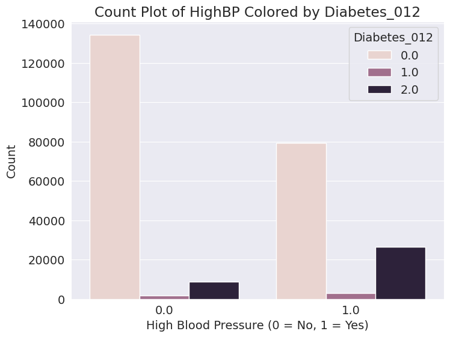
    


```python
def plotGrouped(column):
    plt.figure(figsize=(10, 8))
    sns.countplot(data=data, x=column, hue='Diabetes_012')
    plt.title('PhysActivity Distribution Across Diabetes_012 Classes')
    plt.xlabel('Physical Activity (0 = No, 1 = Yes)')
    plt.ylabel('Count')
    plt.legend(title='Diabetes_012')
    plt.show()
```


```python
plotGrouped('PhysActivity')
```


    
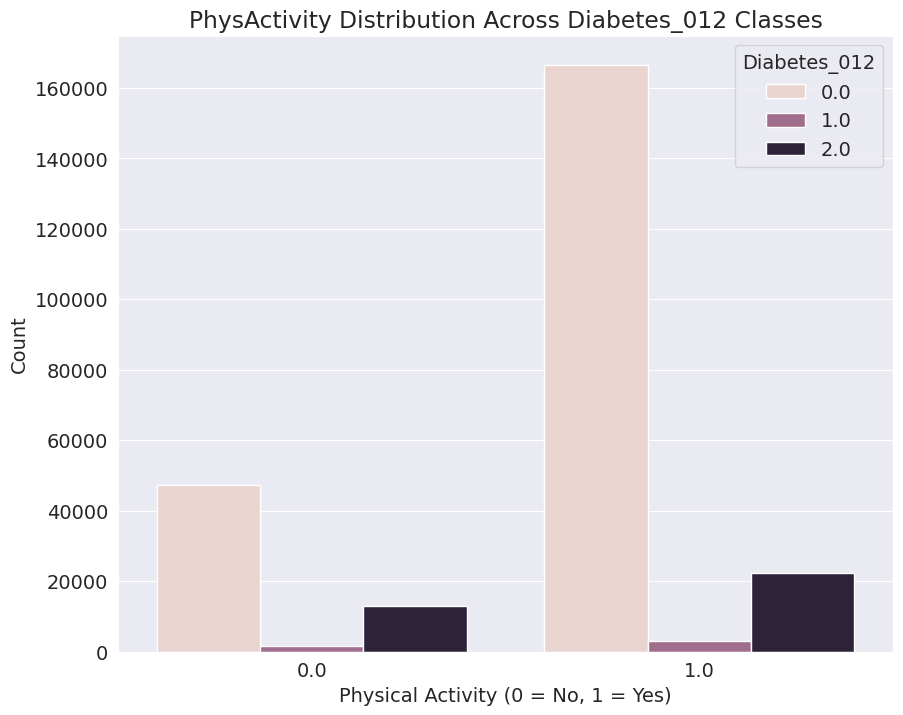
    


```python
def plotStacked(columns, columns_name):
    healthcare_df = data.groupby('Diabetes_012')[columns].sum().reset_index()

    plt.figure(figsize=(8, 6))
    healthcare_df.set_index('Diabetes_012').plot(kind='bar', stacked=True)
    plt.title('{columns_name} by Diabetes_012')
    plt.xlabel('Diabetes_012')
    plt.ylabel('Count')
    plt.xticks(rotation=0)
    plt.legend(columns)
    plt.show()
```


```python
plotStacked(['AnyHealthcare', 'NoDocbcCost'], 'Healthcare Access Rating')
```


    <Figure size 800x600 with 0 Axes>


    
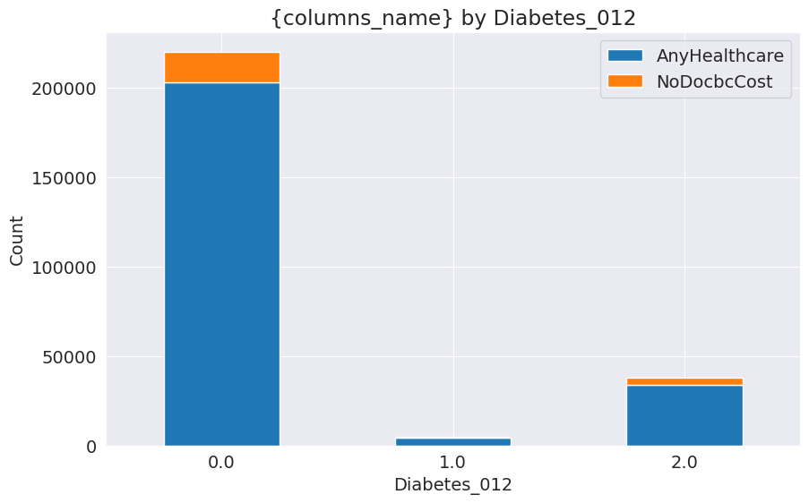
    


```python

```


```python
plotStacked(['Education', 'Income'], 'Income and Education Status')
```


    <Figure size 800x600 with 0 Axes>


    
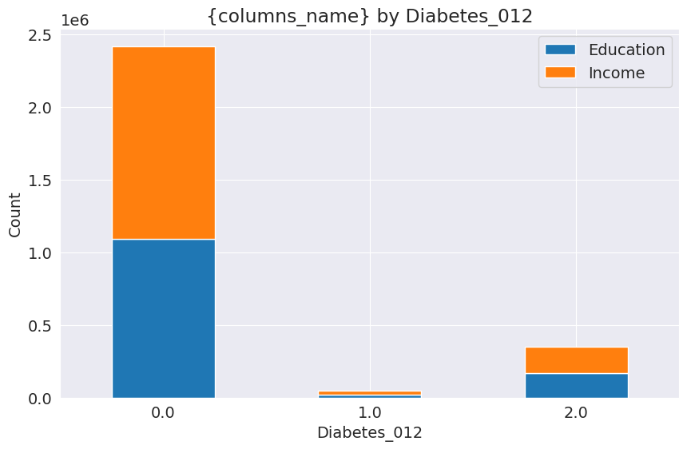
    


```python
def plotBox(column, column_name):
    plt.figure(figsize=(10, 8))
    sns.boxplot(data=data, x='Diabetes_012', y=column)
    plt.title('{column_name} Rating by Diabetes_012')
    plt.xlabel('Diabetes_012')
    plt.ylabel('{column_name} Rating')
    plt.show()
```


```python
plotBox('GenHlth', 'General Health')
```


    
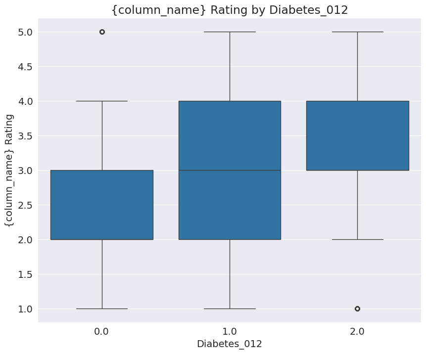
    


```python
plotBox('PhysHlth', 'Physical Health')
```


    

    


## Feature Engineering


```python
data['log_BMI'] = np.log(data['BMI'])
data['log_MentHlth'] = np.log(data['MentHlth'])
```

    /usr/local/lib/python3.10/dist-packages/pandas/core/arraylike.py:396: RuntimeWarning: divide by zero encountered in log
      result = getattr(ufunc, method)(*inputs, **kwargs)
    


```python
data['log_BMI'] = data['log_BMI'].replace([np.inf, -np.inf], np.nan)
data['log_MentHlth'] = data['log_MentHlth'].replace([np.inf, -np.inf], np.nan)
```


```python
data['CardioVascularRisk'] = (data['HeartDiseaseorAttack'])*1.8 + (data['Stroke'])*1.0
```


```python
def mobility_score(row):
    return row['PhysActivity']*(-1.22) + (row['DiffWalk'])*2.24

data['MobilityScore'] = data.apply(mobility_score, axis=1)
```


```python
def substance_use(row):
    return row['Smoker']*0.62 + row['HvyAlcoholConsump']*(-0.57)

data['SubstanceUse'] = data.apply(substance_use, axis=1)
```


```python
def diet_quality(row):
    return row['Fruits']*(-0.59) + row['Veggies']*(-0.42)

data['DietQuality'] = data.apply(diet_quality, axis=1)
```


```python
def socioeconomic_status(row):
    return ((row['Education']-1)/5)*(-1.71) + ((row['Income']-1)/7)*(-1.30)

data['SocioeconomicStatus'] = data.apply(socioeconomic_status, axis=1)
```


```python
def healthcare_access(row):
    return (row['AnyHealthcare'] * 0.15) + (row['NoDocbcCost'] * 0.35)

data['HealthcareAccess'] = data.apply(healthcare_access, axis=1)
```


```python
data['MetabolicRisk'] = (data['log_BMI'])*2.3 + data['HighBP']*2.71 + data['HighChol']*2.09
```


```python
data['BMI_Age'] = ((data['BMI']-12)/86) * ((data['Age']-1)/12)
```


```python
data['BP_Chol'] = data['HighBP'] * data['HighChol']
```


```python
data['Sum_Health_Conditions'] = data[['HighBP', 'HighChol', 'HeartDiseaseorAttack', 'Stroke']].sum(axis=1)
```


```python
data['HealthSeverity'] = (data['GenHlth']-1)/4*3.02 + ((30 - data['PhysHlth']) / 30)*1.76  + ((30 - data['MentHlth']) / 30)*0.73
```


```python
data.sample()
```


  <div id="df-5d590935-5839-4a97-82ea-20a32e3ee298" class="colab-df-container">
    <div>
<style scoped>
    .dataframe tbody tr th:only-of-type {
        vertical-align: middle;
    }

    .dataframe tbody tr th {
        vertical-align: top;
    }

    .dataframe thead th {
        text-align: right;
    }
</style>
<table border="1" class="dataframe">
  <thead>
    <tr style="text-align: right;">
      <th></th>
      <th>Diabetes_012</th>
      <th>HighBP</th>
      <th>HighChol</th>
      <th>CholCheck</th>
      <th>BMI</th>
      <th>Smoker</th>
      <th>Stroke</th>
      <th>HeartDiseaseorAttack</th>
      <th>PhysActivity</th>
      <th>Fruits</th>
      <th>Veggies</th>
      <th>HvyAlcoholConsump</th>
      <th>AnyHealthcare</th>
      <th>NoDocbcCost</th>
      <th>GenHlth</th>
      <th>MentHlth</th>
      <th>PhysHlth</th>
      <th>DiffWalk</th>
      <th>Sex</th>
      <th>Age</th>
      <th>Education</th>
      <th>Income</th>
      <th>log_BMI</th>
      <th>log_MentHlth</th>
      <th>CardioVascularRisk</th>
      <th>MobilityScore</th>
      <th>SubstanceUse</th>
      <th>DietQuality</th>
      <th>SocioeconomicStatus</th>
      <th>HealthcareAccess</th>
      <th>MetabolicRisk</th>
      <th>BMI_Age</th>
      <th>BP_Chol</th>
      <th>Sum_Health_Conditions</th>
      <th>HealthSeverity</th>
    </tr>
  </thead>
  <tbody>
    <tr>
      <th>55289</th>
      <td>0.0</td>
      <td>1.0</td>
      <td>1.0</td>
      <td>1.0</td>
      <td>25.0</td>
      <td>0.0</td>
      <td>0.0</td>
      <td>0.0</td>
      <td>0.0</td>
      <td>1.0</td>
      <td>0.0</td>
      <td>0.0</td>
      <td>1.0</td>
      <td>0.0</td>
      <td>3.0</td>
      <td>0.0</td>
      <td>0.0</td>
      <td>1.0</td>
      <td>1.0</td>
      <td>12.0</td>
      <td>4.0</td>
      <td>4.0</td>
      <td>3.218876</td>
      <td>NaN</td>
      <td>0.0</td>
      <td>2.24</td>
      <td>0.0</td>
      <td>-0.59</td>
      <td>-1.583143</td>
      <td>0.15</td>
      <td>12.203414</td>
      <td>0.138566</td>
      <td>1.0</td>
      <td>2.0</td>
      <td>4.0</td>
    </tr>
  </tbody>
</table>
</div>
    <div class="colab-df-buttons">

  <div class="colab-df-container">
    <button class="colab-df-convert" onclick="convertToInteractive('df-5d590935-5839-4a97-82ea-20a32e3ee298')"
            title="Convert this dataframe to an interactive table."
            style="display:none;">

  <svg xmlns="http://www.w3.org/2000/svg" height="24px" viewBox="0 -960 960 960">
    <path d="M120-120v-720h720v720H120Zm60-500h600v-160H180v160Zm220 220h160v-160H400v160Zm0 220h160v-160H400v160ZM180-400h160v-160H180v160Zm440 0h160v-160H620v160ZM180-180h160v-160H180v160Zm440 0h160v-160H620v160Z"/>
  </svg>
    </button>

  <style>
    .colab-df-container {
      display:flex;
      gap: 12px;
    }

    .colab-df-convert {
      background-color: #E8F0FE;
      border: none;
      border-radius: 50%;
      cursor: pointer;
      display: none;
      fill: #1967D2;
      height: 32px;
      padding: 0 0 0 0;
      width: 32px;
    }

    .colab-df-convert:hover {
      background-color: #E2EBFA;
      box-shadow: 0px 1px 2px rgba(60, 64, 67, 0.3), 0px 1px 3px 1px rgba(60, 64, 67, 0.15);
      fill: #174EA6;
    }

    .colab-df-buttons div {
      margin-bottom: 4px;
    }

    [theme=dark] .colab-df-convert {
      background-color: #3B4455;
      fill: #D2E3FC;
    }

    [theme=dark] .colab-df-convert:hover {
      background-color: #434B5C;
      box-shadow: 0px 1px 3px 1px rgba(0, 0, 0, 0.15);
      filter: drop-shadow(0px 1px 2px rgba(0, 0, 0, 0.3));
      fill: #FFFFFF;
    }
  </style>

    <script>
      const buttonEl =
        document.querySelector('#df-5d590935-5839-4a97-82ea-20a32e3ee298 button.colab-df-convert');
      buttonEl.style.display =
        google.colab.kernel.accessAllowed ? 'block' : 'none';

      async function convertToInteractive(key) {
        const element = document.querySelector('#df-5d590935-5839-4a97-82ea-20a32e3ee298');
        const dataTable =
          await google.colab.kernel.invokeFunction('convertToInteractive',
                                                    [key], {});
        if (!dataTable) return;

        const docLinkHtml = 'Like what you see? Visit the ' +
          '<a target="_blank" href=https://colab.research.google.com/notebooks/data_table.ipynb>data table notebook</a>'
          + ' to learn more about interactive tables.';
        element.innerHTML = '';
        dataTable['output_type'] = 'display_data';
        await google.colab.output.renderOutput(dataTable, element);
        const docLink = document.createElement('div');
        docLink.innerHTML = docLinkHtml;
        element.appendChild(docLink);
      }
    </script>
  </div>


    </div>
  </div>


```python
data.corr()['Diabetes_012'].abs().sort_values()
```


    AnyHealthcare            0.015410
    Sex                      0.031040
    NoDocbcCost              0.035436
    HealthcareAccess         0.041490
    Fruits                   0.042192
                               ...   
    GenHlth                  0.302587
    BMI_Age                  0.308930
    Sum_Health_Conditions    0.321549
    MetabolicRisk            0.332414
    Diabetes_012             1.000000
    Name: Diabetes_012, Length: 35, dtype: float64


### Data preprocessing and Balancing Classes


```python
data.columns
```


    Index(['Diabetes_012', 'HighBP', 'HighChol', 'CholCheck', 'BMI', 'Smoker',
           'Stroke', 'HeartDiseaseorAttack', 'PhysActivity', 'Fruits', 'Veggies',
           'HvyAlcoholConsump', 'AnyHealthcare', 'NoDocbcCost', 'GenHlth',
           'MentHlth', 'PhysHlth', 'DiffWalk', 'Sex', 'Age', 'Education', 'Income',
           'log_BMI', 'log_MentHlth', 'CardioVascularRisk', 'MobilityScore',
           'SubstanceUse', 'DietQuality', 'SocioeconomicStatus',
           'HealthcareAccess', 'MetabolicRisk', 'BMI_Age', 'BP_Chol',
           'Sum_Health_Conditions', 'HealthSeverity'],
          dtype='object')


```python
  input_cols_simple = ['HighBP', 'HighChol', 'CholCheck', 'BMI', 'Smoker',
       'Stroke', 'HeartDiseaseorAttack', 'PhysActivity', 'Fruits', 'Veggies',
       'HvyAlcoholConsump', 'AnyHealthcare', 'NoDocbcCost', 'GenHlth',
       'MentHlth', 'PhysHlth', 'DiffWalk', 'Sex', 'Age', 'Education', 'Income']
```


```python
input_cols_eng = ['MetabolicRisk', 'Sum_Health_Conditions', 'BMI_Age',
                  'BP_Chol', 'MobilityScore', 'CardioVascularRisk',
                  'SocioeconomicStatus', 'SubstanceUse', 'DietQuality',
                  'GenHlth', 'HealthSeverity', 'HealthcareAccess']
```


```python
input_cols_all = input_cols_simple + input_cols_eng
```


```python
target_col = ['Diabetes_012']
```


```python
imputer = SimpleImputer(strategy='mean').fit(data[input_cols_eng])
data[input_cols_eng] = imputer.transform(data[input_cols_eng])
```


```python
scaler = MinMaxScaler().fit(data[input_cols_eng])
data[input_cols_eng] = scaler.transform(data[input_cols_eng])
```


```python
train_val_inputs, test_inputs, train_val_target, test_target = train_test_split(data[input_cols_eng], data[target_col], test_size=0.2, random_state=42)
```


```python
smote = SMOTE(random_state=42)
train_val_inputs_resampled, train_val_target_resampled = smote.fit_resample(train_val_inputs, train_val_target)
```


```python
train_val_target_resampled.value_counts()
```


    Diabetes_012
    0.0             170908
    1.0             170908
    2.0             170908
    Name: count, dtype: int64


```python
train_inputs, val_inputs, train_target, val_target = train_test_split(train_val_inputs_resampled, train_val_target_resampled, test_size=0.1, random_state=42)
```


```python
data['Diabetes_012'].value_counts()
```


    Diabetes_012
    0.0    213703
    2.0     35346
    1.0      4631
    Name: count, dtype: int64


```python
train_target.value_counts()
```


    Diabetes_012
    0.0             153844
    1.0             153821
    2.0             153786
    Name: count, dtype: int64


### Hardcoded Model


```python
def returnNo(df):
    return np.full(len(df), 0)
```


```python
def returnRandom(df):
    return np.random.choice([0,1,2], len(df))
```


```python
def rmse(inputs, target):
    return mean_squared_error(inputs, target)
```


```python
rmse(train_target, returnNo(train_inputs))
```


    1.6664066173873282


```python
accuracy_score(train_target, returnNo(train_inputs))
```


    0.33339184442118447


```python
rmse(train_target, returnRandom(train_inputs))
```


    1.33298876803821


```python
accuracy_score(train_target, returnRandom(train_inputs))
```


    0.3328825812491467


### Baseline Models


```python
def predict_model(model):
    model = model.fit(train_inputs, train_target)
    train_preds = model.predict(train_inputs)
    val_preds = model.predict(val_inputs)
    train_score = model.score(train_inputs, train_target)
    val_score = accuracy_score(val_preds, val_target)
    train_rmse = rmse(train_target, train_preds)
    val_rmse = rmse(val_target, val_preds)
    train_f1 = f1_score(train_target, train_preds, average='macro')
    val_f1 = f1_score(val_target, val_preds, average='macro')
    train_cm = confusion_matrix(train_target, train_preds, normalize='true')
    val_cm = confusion_matrix(train_target, train_preds, normalize='true')
    print('Training Score: ', train_score, ', Training RMSE: ', train_rmse, ', Training F1 Score: ', train_f1)
    print('Validation Score: ', val_score, ', validation RMSE: ', val_rmse, ', Validation F1 Score: ', val_f1)
    print('Training F1 Scores: ', f1_score(train_target, train_preds, average=None))
    print('Validation F1 Scores: ', f1_score(val_target, val_preds, average=None))
    print('Training Confusion Matrix: \n', train_cm)
    print('Validation Confusion Matrix: \n', val_cm)
    return model
```


```python
predict_model(LogisticRegression(random_state=42, solver='liblinear'))
```

    /usr/local/lib/python3.10/dist-packages/sklearn/utils/validation.py:1143: DataConversionWarning: A column-vector y was passed when a 1d array was expected. Please change the shape of y to (n_samples, ), for example using ravel().
      y = column_or_1d(y, warn=True)
    

    Training Score:  0.5167179180454696 , Training RMSE:  0.851979950200563 , Training F1 Score:  0.49760067088986704
    Validation Score:  0.5166071811674761 , validation RMSE:  0.8587365670040762 , Validation F1 Score:  0.4977606701361748
    Training F1 Scores:  [0.63168023 0.31607822 0.54504356]
    Validation F1 Scores:  [0.63005077 0.31912528 0.54410596]
    Training Confusion Matrix: 
     [[0.6998128  0.13083383 0.16935337]
     [0.31667328 0.24982285 0.43350388]
     [0.19935495 0.20013525 0.6005098 ]]
    Validation Confusion Matrix: 
     [[0.6998128  0.13083383 0.16935337]
     [0.31667328 0.24982285 0.43350388]
     [0.19935495 0.20013525 0.6005098 ]]
    


<style>#sk-container-id-5 {color: black;background-color: white;}#sk-container-id-5 pre{padding: 0;}#sk-container-id-5 div.sk-toggleable {background-color: white;}#sk-container-id-5 label.sk-toggleable__label {cursor: pointer;display: block;width: 100%;margin-bottom: 0;padding: 0.3em;box-sizing: border-box;text-align: center;}#sk-container-id-5 label.sk-toggleable__label-arrow:before {content: "▸";float: left;margin-right: 0.25em;color: #696969;}#sk-container-id-5 label.sk-toggleable__label-arrow:hover:before {color: black;}#sk-container-id-5 div.sk-estimator:hover label.sk-toggleable__label-arrow:before {color: black;}#sk-container-id-5 div.sk-toggleable__content {max-height: 0;max-width: 0;overflow: hidden;text-align: left;background-color: #f0f8ff;}#sk-container-id-5 div.sk-toggleable__content pre {margin: 0.2em;color: black;border-radius: 0.25em;background-color: #f0f8ff;}#sk-container-id-5 input.sk-toggleable__control:checked~div.sk-toggleable__content {max-height: 200px;max-width: 100%;overflow: auto;}#sk-container-id-5 input.sk-toggleable__control:checked~label.sk-toggleable__label-arrow:before {content: "▾";}#sk-container-id-5 div.sk-estimator input.sk-toggleable__control:checked~label.sk-toggleable__label {background-color: #d4ebff;}#sk-container-id-5 div.sk-label input.sk-toggleable__control:checked~label.sk-toggleable__label {background-color: #d4ebff;}#sk-container-id-5 input.sk-hidden--visually {border: 0;clip: rect(1px 1px 1px 1px);clip: rect(1px, 1px, 1px, 1px);height: 1px;margin: -1px;overflow: hidden;padding: 0;position: absolute;width: 1px;}#sk-container-id-5 div.sk-estimator {font-family: monospace;background-color: #f0f8ff;border: 1px dotted black;border-radius: 0.25em;box-sizing: border-box;margin-bottom: 0.5em;}#sk-container-id-5 div.sk-estimator:hover {background-color: #d4ebff;}#sk-container-id-5 div.sk-parallel-item::after {content: "";width: 100%;border-bottom: 1px solid gray;flex-grow: 1;}#sk-container-id-5 div.sk-label:hover label.sk-toggleable__label {background-color: #d4ebff;}#sk-container-id-5 div.sk-serial::before {content: "";position: absolute;border-left: 1px solid gray;box-sizing: border-box;top: 0;bottom: 0;left: 50%;z-index: 0;}#sk-container-id-5 div.sk-serial {display: flex;flex-direction: column;align-items: center;background-color: white;padding-right: 0.2em;padding-left: 0.2em;position: relative;}#sk-container-id-5 div.sk-item {position: relative;z-index: 1;}#sk-container-id-5 div.sk-parallel {display: flex;align-items: stretch;justify-content: center;background-color: white;position: relative;}#sk-container-id-5 div.sk-item::before, #sk-container-id-5 div.sk-parallel-item::before {content: "";position: absolute;border-left: 1px solid gray;box-sizing: border-box;top: 0;bottom: 0;left: 50%;z-index: -1;}#sk-container-id-5 div.sk-parallel-item {display: flex;flex-direction: column;z-index: 1;position: relative;background-color: white;}#sk-container-id-5 div.sk-parallel-item:first-child::after {align-self: flex-end;width: 50%;}#sk-container-id-5 div.sk-parallel-item:last-child::after {align-self: flex-start;width: 50%;}#sk-container-id-5 div.sk-parallel-item:only-child::after {width: 0;}#sk-container-id-5 div.sk-dashed-wrapped {border: 1px dashed gray;margin: 0 0.4em 0.5em 0.4em;box-sizing: border-box;padding-bottom: 0.4em;background-color: white;}#sk-container-id-5 div.sk-label label {font-family: monospace;font-weight: bold;display: inline-block;line-height: 1.2em;}#sk-container-id-5 div.sk-label-container {text-align: center;}#sk-container-id-5 div.sk-container {/* jupyter's `normalize.less` sets `[hidden] { display: none; }` but bootstrap.min.css set `[hidden] { display: none !important; }` so we also need the `!important` here to be able to override the default hidden behavior on the sphinx rendered scikit-learn.org. See: https://github.com/scikit-learn/scikit-learn/issues/21755 */display: inline-block !important;position: relative;}#sk-container-id-5 div.sk-text-repr-fallback {display: none;}</style><div id="sk-container-id-5" class="sk-top-container"><div class="sk-text-repr-fallback"><pre>LogisticRegression(random_state=42, solver=&#x27;liblinear&#x27;)</pre><b>In a Jupyter environment, please rerun this cell to show the HTML representation or trust the notebook. <br />On GitHub, the HTML representation is unable to render, please try loading this page with nbviewer.org.</b></div><div class="sk-container" hidden><div class="sk-item"><div class="sk-estimator sk-toggleable"><input class="sk-toggleable__control sk-hidden--visually" id="sk-estimator-id-5" type="checkbox" checked><label for="sk-estimator-id-5" class="sk-toggleable__label sk-toggleable__label-arrow">LogisticRegression</label><div class="sk-toggleable__content"><pre>LogisticRegression(random_state=42, solver=&#x27;liblinear&#x27;)</pre></div></div></div></div></div>


### Decision Tree Models


```python
def decision_tree_model(**params):
    return predict_model(DecisionTreeClassifier(random_state=42, **params))
```


```python
%%time
model = decision_tree_model()
```

    Training Score:  0.9960645875726784 , Training RMSE:  0.013856292434082925 , Training F1 Score:  0.9960669257018743
    Validation Score:  0.8281356659450393 , validation RMSE:  0.4607883291400932 , Validation F1 Score:  0.8276892194545905
    Training F1 Scores:  [0.99419703 0.99905656 0.99494719]
    Validation F1 Scores:  [0.82224646 0.88831229 0.77250892]
    Training Confusion Matrix: 
     [[9.98927485e-01 6.50009100e-06 1.06601492e-03]
     [1.73578380e-03 9.98225210e-01 3.90063775e-05]
     [8.85646288e-03 1.04040680e-04 9.91039496e-01]]
    Validation Confusion Matrix: 
     [[9.98927485e-01 6.50009100e-06 1.06601492e-03]
     [1.73578380e-03 9.98225210e-01 3.90063775e-05]
     [8.85646288e-03 1.04040680e-04 9.91039496e-01]]
    CPU times: user 9.05 s, sys: 13 ms, total: 9.06 s
    Wall time: 9.16 s
    


```python
%%time
def max_depth_error(md):
    model = DecisionTreeClassifier(max_depth=md, random_state=42)
    model.fit(train_inputs, train_target)
    train_acc = 1 - model.score(train_inputs, train_target)
    val_acc = 1 - model.score(val_inputs, val_target)
    return {'Max Depth': md, 'Training Error': train_acc, 'Validation Error': val_acc}


errors_df = pd.DataFrame([max_depth_error(md) for md in range(1, 26)])

plt.figure()
plt.plot(errors_df['Max Depth'], errors_df['Training Error'])
plt.plot(errors_df['Max Depth'], errors_df['Validation Error'])
plt.title('Training vs. Validation Error')
plt.xticks(range(0,21, 2))
plt.xlabel('Max. Depth')
plt.ylabel('Prediction Error (1 - Accuracy)')
plt.legend(['Training', 'Validation'])

errors_df
```


```python
class_names = [str(cls) for cls in model.classes_]

plt.figure(figsize=(20, 10))
plot_tree(model, max_depth=2, feature_names=train_inputs.columns, class_names=class_names, filled=True, rounded=True)
plt.show()
```


    
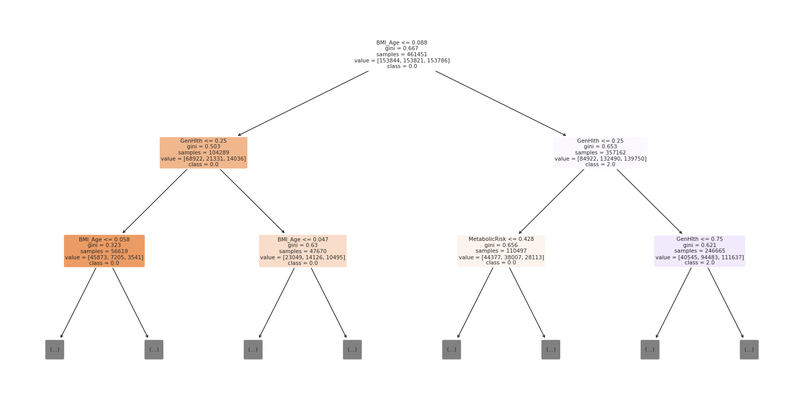
    


### Random Forests


```python
def random_forest_model(**params):
    model = RandomForestClassifier(random_state=42, n_jobs=-1, **params)
    model.fit(train_inputs, train_target)
    train_preds = model.predict(train_inputs)
    val_preds = model.predict(val_inputs)
    trainingScore = model.score(train_inputs, train_target)
    validationScore = accuracy_score(val_preds, val_target)
    train_rmse = rmse(train_target, train_preds)
    val_rmse = rmse(val_target, val_preds)
    train_f1 = f1_score(train_target, train_preds, average='macro')
    val_f1 = f1_score(val_target, val_preds, average='macro')
    train_cm = confusion_matrix(train_target, train_preds, normalize='true')
    val_cm = confusion_matrix(val_target, val_preds, normalize='true')
    val_cmn = val_cm.astype('float') / val_cm.sum(axis=1)[:, np.newaxis]
    train_cmn = train_cm.astype('float') / train_cm.sum(axis=1)[:, np.newaxis]
    print('Training Score: ', trainingScore, ', Training RMSE: ', train_rmse, ', Training F1 Score: ', train_f1)
    print('Validation Score: ', validationScore, ', validation RMSE: ', val_rmse, ', Validation F1 Score: ', val_f1)
    print('Training F1 Scores: ', f1_score(train_target, train_preds, average=None))
    print('Validation F1 Scores: ', f1_score(val_target, val_preds, average=None))
    print('Training Confusion Matrix: \n', train_cmn)
    print('Validation Confusion Matrix: \n', val_cmn)
    return model
```


```python
train_target = train_target.values.ravel()
val_target = val_target.values.ravel()
test_target = test_target.values.ravel()

rf_model = RandomForestClassifier(random_state=42, n_jobs=-1,
                                  n_estimators=14, max_depth=8,
                                  min_samples_split= 10, min_samples_leaf= 3,
                                  max_leaf_nodes= 512, max_features= 'sqrt',
                                  bootstrap= False)
rf_model.fit(train_inputs, train_target)

train_preds = rf_model.predict(train_inputs)
val_preds = rf_model.predict(val_inputs)
trainingScore = rf_model.score(train_inputs, train_target)
validationScore = accuracy_score(val_preds, val_target)
train_rmse = rmse(train_target, train_preds)
val_rmse = rmse(val_target, val_preds)
train_f1 = f1_score(train_target, train_preds, average='macro')
val_f1 = f1_score(val_target, val_preds, average='macro')
train_cm = confusion_matrix(train_target, train_preds, normalize='true')
val_cm = confusion_matrix(val_target, val_preds, normalize='true')
val_cmn = val_cm.astype('float') / val_cm.sum(axis=1)[:, np.newaxis]
train_cmn = train_cm.astype('float') / train_cm.sum(axis=1)[:, np.newaxis]
print('Training Score: ', trainingScore, ', Training RMSE: ', train_rmse, ', Training F1 Score: ', train_f1)
print('Validation Score: ', validationScore, ', validation RMSE: ', val_rmse, ', Validation F1 Score: ', val_f1)
print('Training F1 Scores: ', f1_score(train_target, train_preds, average=None))
print('Validation F1 Scores: ', f1_score(val_target, val_preds, average=None))
print('Training Confusion Matrix: \n', train_cmn)
print('Validation Confusion Matrix: \n', val_cmn)


test_preds = rf_model.predict(test_inputs)
testScore = rf_model.score(test_inputs, test_target)
test_rmse = rmse(test_target, test_preds)
test_f1 = f1_score(test_target, test_preds, average='macro')
test_cm = confusion_matrix(test_target, test_preds, normalize='true')
test_cmn = test_cm.astype('float') / test_cm.sum(axis=1)[:, np.newaxis]
print('Testing Score: ', testScore, ', Testing RMSE: ', test_rmse, ', Testing F1 Score: ', test_f1)
print('Testing F1 Scores: ', f1_score(test_target, test_preds, average=None))
print('Testing Confusion Matrix: \n', test_cmn)
sns.heatmap(test_cmn, annot=True).set(xlabel='Predicted', ylabel='Actual')
plt.show()
```

    Training Score:  0.6078131805977233 , Training RMSE:  0.8495762339353616 , Training F1 Score:  0.6065342582900316
    Validation Score:  0.604996781932011 , validation RMSE:  0.8540774248367089 , Validation F1 Score:  0.6038973244471664
    Training F1 Scores:  [0.68656764 0.54823564 0.5847995 ]
    Validation F1 Scores:  [0.68628244 0.54663964 0.57876989]
    Training Confusion Matrix: 
     [[0.69688776 0.12542576 0.17768649]
     [0.18135365 0.51390252 0.30474383]
     [0.1519059  0.23545706 0.61263704]]
    Validation Confusion Matrix: 
     [[0.69573371 0.12365213 0.18061416]
     [0.17721075 0.51290455 0.30988471]
     [0.15383717 0.23969162 0.60647121]]
    Testing Score:  0.676383632923368 , Testing RMSE:  0.9267457126386072 , Testing F1 Score:  0.43508193100715914
    Testing F1 Scores:  [0.80056032 0.05296311 0.45172237]
    Testing Confusion Matrix: 
     [[0.69442692 0.12686061 0.17871247]
     [0.34533898 0.21822034 0.43644068]
     [0.20065742 0.17150207 0.6278405 ]]
    


    
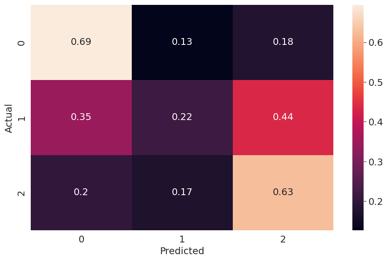
    


### XGBoost


```python
xgb_model = xgb.XGBClassifier(random_state=42, use_label_encoder=False,
                              eval_metric='mlogloss',
                              subsample= 0.7, reg_lambda= 0.1,
                              reg_alpha= 1, n_estimators= 60,
                              min_child_weight= 0.5, max_depth= 6,
                              learning_rate= 0.5, gamma= 0.05,
                              colsample_bytree= 0.2)
xgb_model.fit(train_inputs, train_target)

xgb_model.fit(train_inputs, train_target)
train_preds = xgb_model.predict(train_inputs)
val_preds = xgb_model.predict(val_inputs)
trainingScore = xgb_model.score(train_inputs, train_target)
validationScore = accuracy_score(val_preds, val_target)
train_rmse = rmse(train_target, train_preds)
val_rmse = rmse(val_target, val_preds)
train_f1 = f1_score(train_target, train_preds, average='macro')
val_f1 = f1_score(val_target, val_preds, average='macro')
train_cm = confusion_matrix(train_target, train_preds, normalize='true')
val_cm = confusion_matrix(val_target, val_preds, normalize='true')
val_cmn = val_cm.astype('float') / val_cm.sum(axis=1)[:, np.newaxis]
train_cmn = train_cm.astype('float') / train_cm.sum(axis=1)[:, np.newaxis]
print('Training Score: ', trainingScore, ', Training RMSE: ', train_rmse, ', Training F1 Score: ', train_f1)
print('Validation Score: ', validationScore, ', validation RMSE: ', val_rmse, ', Validation F1 Score: ', val_f1)
print('Training F1 Scores: ', f1_score(train_target, train_preds, average=None))
print('Validation F1 Scores: ', f1_score(val_target, val_preds, average=None))
print('Training Confusion Matrix: \n', train_cmn)
print('Validation Confusion Matrix: \n', val_cmn)


test_preds = xgb_model.predict(test_inputs)
testScore = xgb_model.score(test_inputs, test_target)
test_rmse = rmse(test_target, test_preds)
test_f1 = f1_score(test_target, test_preds, average='macro')
test_cm = confusion_matrix(test_target, test_preds, normalize='true')
test_cmn = test_cm.astype('float') / test_cm.sum(axis=1)[:, np.newaxis]
print('Testing Score: ', testScore, ', Testing RMSE: ', test_rmse, ', Testing F1 Score: ', test_f1)
print('Testing F1 Scores: ', f1_score(test_target, test_preds, average=None))
print('Testing Confusion Matrix: \n', test_cmn)
sns.heatmap(test_cmn, annot=True).set(xlabel='Predicted', ylabel='Actual')
plt.show()
```

    Training Score:  0.7355320499901398 , Training RMSE:  0.7264852701906571 , Training F1 Score:  0.7330182156388986
    Validation Score:  0.7338755290308739 , validation RMSE:  0.7286578149586365 , Validation F1 Score:  0.731523205850249
    Training F1 Scores:  [0.83345774 0.72256041 0.64303651]
    Validation F1 Scores:  [0.83299598 0.72091813 0.6406555 ]
    Training Confusion Matrix: 
     [[0.88186085 0.00554458 0.11259458]
     [0.08362967 0.69026336 0.22610697]
     [0.15072894 0.214844   0.63442706]]
    Validation Confusion Matrix: 
     [[0.88027426 0.00521566 0.11451008]
     [0.08240183 0.68929596 0.22830222]
     [0.1502161  0.21732274 0.63246116]]
    Testing Score:  0.8102333648691264 , Testing RMSE:  0.8285617095092179 , Testing F1 Score:  0.44952574917010324
    Testing F1 Scores:  [0.89055121 0.01603849 0.44198755]
    Testing Confusion Matrix: 
     [[0.87907466 0.00565487 0.11527048]
     [0.63983051 0.01059322 0.34957627]
     [0.49564099 0.00728884 0.49707017]]
    


    
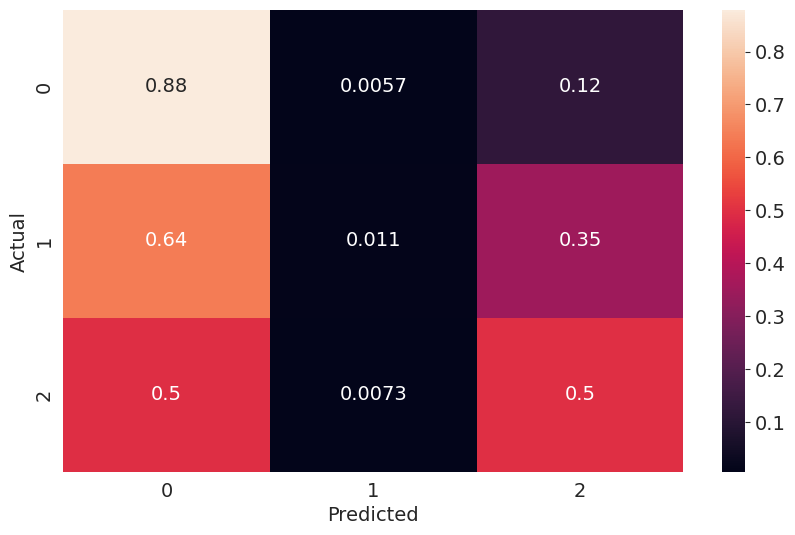
    


## Ensemble Models


```python
base_models = [
    ('xgb', xgb_model),
    ('rf', rf_model),
]

stack_model = StackingClassifier(
    estimators=base_models,
    final_estimator=LogisticRegression()
)

stack_model.fit(train_inputs, train_target)

train_preds = stack_model.predict(train_inputs)
val_preds = stack_model.predict(val_inputs)
trainingScore = stack_model.score(train_inputs, train_target)
validationScore = accuracy_score(val_preds, val_target)
train_rmse = rmse(train_target, train_preds)
val_rmse = rmse(val_target, val_preds)
train_f1 = f1_score(train_target, train_preds, average='macro')
val_f1 = f1_score(val_target, val_preds, average='macro')
train_cm = confusion_matrix(train_target, train_preds, normalize='true')
val_cm = confusion_matrix(val_target, val_preds, normalize='true')
val_cmn = val_cm.astype('float') / val_cm.sum(axis=1)[:, np.newaxis]
train_cmn = train_cm.astype('float') / train_cm.sum(axis=1)[:, np.newaxis]
print('Training Score: ', trainingScore, ', Training RMSE: ', train_rmse, ', Training F1 Score: ', train_f1)
print('Validation Score: ', validationScore, ', validation RMSE: ', val_rmse, ', Validation F1 Score: ', val_f1)
print('Training F1 Scores: ', f1_score(train_target, train_preds, average=None))
print('Validation F1 Scores: ', f1_score(val_target, val_preds, average=None))
print('Training Confusion Matrix: \n', train_cmn)
print('Validation Confusion Matrix: \n', val_cmn)


test_preds = stack_model.predict(test_inputs)
testScore = stack_model.score(test_inputs, test_target)
test_rmse = rmse(test_target, test_preds)
test_f1 = f1_score(test_target, test_preds, average='macro')
test_cm = confusion_matrix(test_target, test_preds, normalize='true')
test_cmn = test_cm.astype('float') / test_cm.sum(axis=1)[:, np.newaxis]
print('Testing Score: ', testScore, ', Testing RMSE: ', test_rmse, ', Testing F1 Score: ', test_f1)
print('Testing F1 Scores: ', f1_score(test_target, test_preds, average=None))
print('Testing Confusion Matrix: \n', test_cmn)
sns.heatmap(test_cmn, annot=True).set(xlabel='Predicted', ylabel='Actual')
plt.show()
```

    Training Score:  0.7425230414496881 , Training RMSE:  0.7117065078898258 , Training F1 Score:  0.7407542588409601
    Validation Score:  0.7396485479687165 , validation RMSE:  0.715503919237355 , Validation F1 Score:  0.7379511107424775
    Training F1 Scores:  [0.84838878 0.72941588 0.64445812]
    Validation F1 Scores:  [0.8471862  0.72675665 0.63991049]
    Training Confusion Matrix: 
     [[0.88192585 0.00846312 0.10961103]
     [0.05774894 0.70542384 0.23682722]
     [0.13944702 0.22037767 0.64017531]]
    Validation Confusion Matrix: 
     [[0.88045007 0.00826301 0.11128692]
     [0.05729502 0.70427811 0.23842687]
     [0.14022895 0.22514893 0.63462212]]
    Testing Score:  0.8018960895616525 , Testing RMSE:  0.8429942990350607 , Testing F1 Score:  0.4354432019178674
    Testing F1 Scores:  [0.88599724 0.01705757 0.40327479]
    Testing Confusion Matrix: 
     [[0.87905129 0.00908985 0.11185886]
     [0.66101695 0.01271186 0.32627119]
     [0.55466629 0.00886094 0.43647277]]
    


    
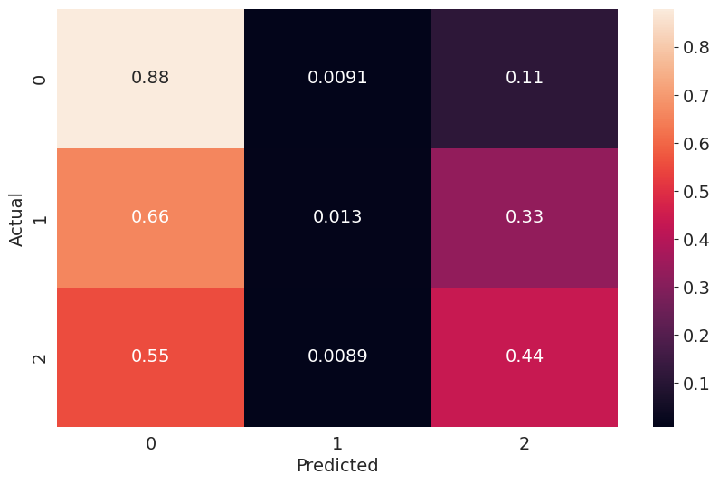
    


## Binary model of Diabetes = True or False


```python
def convert_binary(value):
    if value in [1, 2]:
        return 1
    else:
        return 0

train_val_target_binary = train_val_target.applymap(convert_binary)
test_target_binary = np.vectorize(convert_binary)(test_target)
```


```python
smote = SMOTE(random_state=42)
train_val_inputs_resampled_binary, train_val_target_resampled_binary = smote.fit_resample(train_val_inputs, train_val_target_binary)
```


```python
train_inputs_binary, val_inputs_binary, train_target_binary, val_target_binary = train_test_split(train_val_inputs_resampled_binary, train_val_target_resampled_binary, test_size=0.1, random_state=42)
```


```python
rf_binary_model = RandomForestClassifier(random_state=42, n_jobs=-1,
                                  n_estimators=7, max_depth=12,
                                  min_samples_split= 5, min_samples_leaf= 4,
                                  max_leaf_nodes= 512, max_features= 'sqrt',
                                  bootstrap= False)

xgb_binary_model = xgb.XGBClassifier(random_state=42, use_label_encoder=False,
                              eval_metric='mlogloss',
                              subsample= 1.0, reg_lambda= 5,
                              reg_alpha= 0.7, n_estimators= 10,
                              min_child_weight= 7, max_depth= 6,
                              learning_rate= 0.7, gamma= 0,
                              colsample_bytree= 0.8)
```


```python
base_models = [
    ('xgb', xgb_binary_model),
    ('rf', rf_binary_model),
]

meta_classifier = LogisticRegression(random_state=42)

stacked_binary_model = StackingClassifier(
    estimators=base_models,
    final_estimator=meta_classifier,
    cv=5,
    n_jobs=-1
)

stacked_binary_model.fit(train_inputs_binary, train_target_binary)

train_preds = stacked_binary_model.predict(train_inputs_binary)
val_preds = stacked_binary_model.predict(val_inputs_binary)
trainingScore = stacked_binary_model.score(train_inputs_binary, train_target_binary.values.ravel())
validationScore = accuracy_score(val_preds, val_target_binary.values.ravel())
train_rmse = rmse(train_target_binary.values.ravel(), train_preds)
val_rmse = rmse(val_target_binary.values.ravel(), val_preds)
train_f1 = f1_score(train_target_binary.values.ravel(), train_preds, average='macro')
val_f1 = f1_score(val_target_binary.values.ravel(), val_preds, average='macro')
train_cm = confusion_matrix(train_target_binary.values.ravel(), train_preds, normalize='true')
val_cm = confusion_matrix(val_target_binary.values.ravel(), val_preds, normalize='true')
val_cmn = val_cm.astype('float') / val_cm.sum(axis=1)[:, np.newaxis]
train_cmn = train_cm.astype('float') / train_cm.sum(axis=1)[:, np.newaxis]
print('Training Score: ', trainingScore, ', Training RMSE: ', train_rmse, ', Training F1 Score: ', train_f1)
print('Validation Score: ', validationScore, ', validation RMSE: ', val_rmse, ', Validation F1 Score: ', val_f1)
print('Training F1 Scores: ', f1_score(train_target_binary.values.ravel(), train_preds, average=None))
print('Validation F1 Scores: ', f1_score(val_target_binary.values.ravel(), val_preds, average=None))
print('Training Confusion Matrix: \n', train_cmn)
print('Validation Confusion Matrix: \n', val_cmn)

test_preds = stacked_binary_model.predict(test_inputs)
testScore = stacked_binary_model.score(test_inputs, test_target_binary)
test_rmse = rmse(test_target_binary, test_preds)
test_f1 = f1_score(test_target_binary, test_preds, average='macro')
test_cm = confusion_matrix(test_target_binary, test_preds, normalize='true')
test_cmn = test_cm.astype('float') / test_cm.sum(axis=1)[:, np.newaxis]
print('Testing Score: ', testScore, ', Testing RMSE: ', test_rmse, ', Testing F1 Score: ', test_f1)
print('Testing F1 Scores: ', f1_score(test_target_binary, test_preds, average=None))
print('Testing Confusion Matrix: \n', test_cmn)

sns.heatmap(test_cmn, annot=True).set(xlabel='Predicted', ylabel='Actual')
plt.show()
```

    /usr/local/lib/python3.10/dist-packages/sklearn/preprocessing/_label.py:99: DataConversionWarning: A column-vector y was passed when a 1d array was expected. Please change the shape of y to (n_samples, ), for example using ravel().
      y = column_or_1d(y, warn=True)
    /usr/local/lib/python3.10/dist-packages/sklearn/preprocessing/_label.py:134: DataConversionWarning: A column-vector y was passed when a 1d array was expected. Please change the shape of y to (n_samples, ), for example using ravel().
      y = column_or_1d(y, dtype=self.classes_.dtype, warn=True)
    

    Training Score:  0.8170780862973533 , Training RMSE:  0.427693714827149 , Training F1 Score:  0.8170602102148183
    Validation Score:  0.8158972558656603 , validation RMSE:  0.4290719568258216 , Validation F1 Score:  0.815841830899631
    Training F1 Scores:  [0.81525183 0.81886859]
    Validation F1 Scores:  [0.812647   0.81903666]
    Training Confusion Matrix: 
     [[0.80656372 0.19343628]
     [0.17239113 0.82760887]]
    Validation Confusion Matrix: 
     [[0.80419539 0.19580461]
     [0.17256406 0.82743594]]
    Testing Score:  0.774302270577105 , Testing RMSE:  0.4750765511187592 , Testing F1 Score:  0.6607746032000347
    Testing F1 Scores:  [0.85701799 0.46453121]
    Testing Confusion Matrix: 
     [[0.80191611 0.19808389]
     [0.37451203 0.62548797]]
    


    
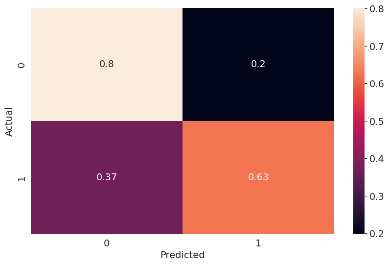
    


### Feature Engineering

Additional features were engineered to enhance model performance:
- **CardioVascularRisk**: Combined indicator of heart disease or stroke.
- **HealthSeverity**: Composite score of general health, physical health, and mental health.
- **MobilityScore**: Indicator combining physical activity and difficulty walking.
- **HealthcareAccess**: Score reflecting healthcare coverage and cost issues.
- **SubstanceUse**: Combined smoking and alcohol consumption indicator.
- **DietQuality**: Combined indicator of fruit and vegetable consumption.
- **SocioeconomicStatus**: Score based on education and income levels.
- **MetabolicRisk**: Combined indicator of BMI, high blood pressure, and high cholesterol.

## Methodology

### Data Collection and Preprocessing
- **Data Collection**: The dataset was sourced from the UCI Machine Learning Repository.
- **Handling Missing Values**: Missing values were imputed using the mean strategy.
- **Normalization**: Features were normalized to a standard scale.
- **Encoding Categorical Variables**: Categorical variables were encoded to numeric values.

### Model Selection and Optimization

#### XGBoost Classifier
- **Hyperparameter Tuning**: RandomizedSearchCV was used to optimize parameters including `n_estimators`, `learning_rate`, `max_depth`, `min_child_weight`, `gamma`, `subsample`, `colsample_bytree`, `reg_alpha`, and `reg_lambda`.

#### Random Forest Classifier
- **Hyperparameter Tuning**: RandomizedSearchCV was employed to optimize parameters such as `n_estimators`, `max_features`, `max_depth`, `min_samples_split`, `min_samples_leaf`, and `bootstrap`.

### Evaluation Metrics
- Models were evaluated using various metrics including accuracy, F1 score, and confusion matrices.
- Training and validation sets were used to ensure robust evaluation of model generalization.

## Results

### XGBoost Classifier
- **Training Accuracy**: 0.7355
- **Validation Accuracy**: 0.7339
- **Training F1 Score**: 0.7330
- **Validation F1 Score**: 0.7315

#### Confusion Matrix
- **Training**: High accuracy in classifying non-diabetic individuals.
- **Validation**: Balanced classification performance across all classes.

### Random Forest Classifier
- **Training Accuracy**: 0.9966
- **Validation Accuracy**: 0.9199
- **Training F1 Score**: 0.9966
- **Validation F1 Score**: 0.9199

#### Confusion Matrix
- **Training**: Excellent performance in classifying all types.
- **Validation**: Strong performance, with some misclassifications in the diabetic class.

### Binary Classification Model
- **Training Accuracy**: 0.8171
- **Validation Accuracy**: 0.8159
- **Training F1 Score**: 0.8171
- **Validation F1 Score**: 0.8159

#### Confusion Matrix
- **Training and Validation**: High accuracy in distinguishing between diabetic and non-diabetic individuals.


## Conclusion

Both XGBoost and Random Forest classifiers showed promising results in diabetes classification. The optimized models can potentially aid healthcare professionals in accurate diagnosis and personalized treatment planning. The binary classification model demonstrated high accuracy in predicting the presence of diabetes, providing a useful tool for early diagnosis.

### Future Work
- **Additional Features**: Incorporate more features from medical records to improve model accuracy.
- **Advanced Ensemble Techniques**: Explore stacking and boosting techniques to further enhance model performance.
- **Real-time Application**: Develop a real-time predictive application for use in clinical settings.

## References
1. National Institute of Diabetes and Digestive and Kidney Diseases (NIDDK). "Diabetes Dataset." UCI Machine Learning Repository.
2. World Health Organization. "Diabetes."

